* How to use One Helm Chart for EKS and GKE *

  Today’s Agenda :
   
   - How to use One Helm Chart for EKS and GKE

   - Kubernetes RBAC Best Practices and Tooling Collection

   - Useful Git Shortcuts and Autocomplete for Windows Bash Terminal

   - Red Hat OpenShift GitOps 1.12: Key Updates and Enhancements

   - Google Cloud Functions and Docker Engine Critical Flaws Exposed

        * How to use One Helm Chart for EKS and GKE *

    - Today, I'm going to walk you through how to do just that with a real-world example of an e-commerce application called ecom-app.

    - First, let's break down the sample structure of a Helm chart and understand the role of each file.

    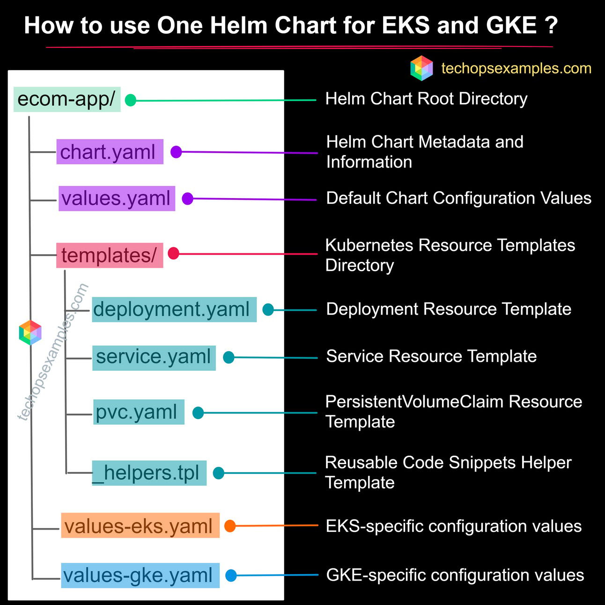
        Helm Chart Structure

    - Now, let's dive into the actual code that makes all this happen.

    chart.yaml:

    - This file is like the blueprint of our Helm chart. It gives Kubernetes all the information it needs about our chart.

    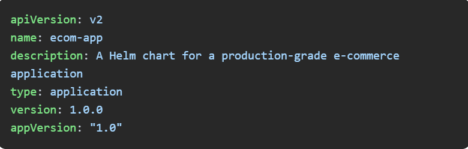

    values.yaml:

    - Here, we define the default configuration values. These are the settings that work for both EKS and GKE unless overridden.

    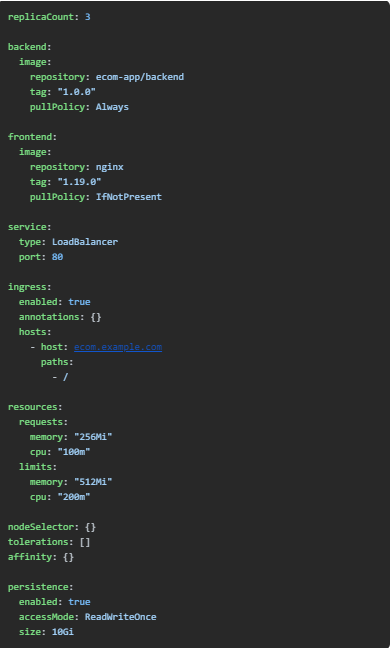

    deployment-backend.yaml:

    - This template is for deploying our backend service. It ensures our backend containers run smoothly, with all the necessary configurations.

    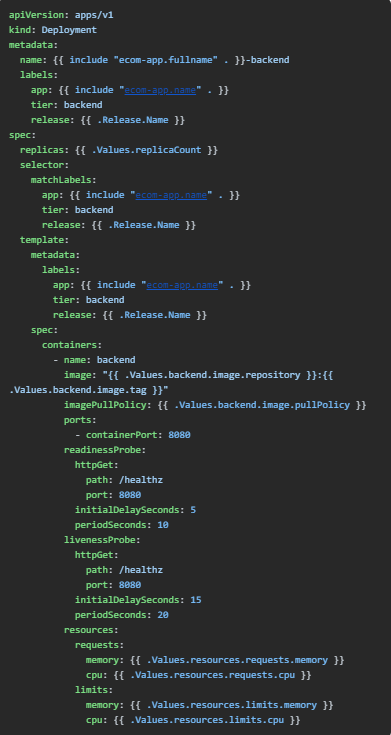

    deployment-frontend.yaml:

    - Our frontend service uses Nginx. This deployment template handles all the settings needed to run our frontend containers.

    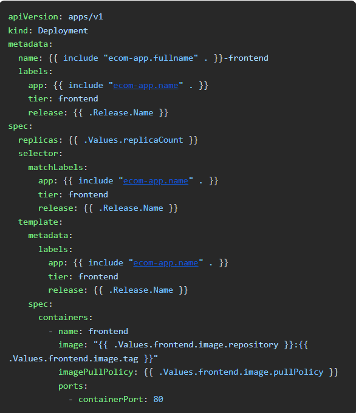

    service.yaml:

    - This template sets up the Kubernetes Service. It defines how our application will be accessible over the network.

    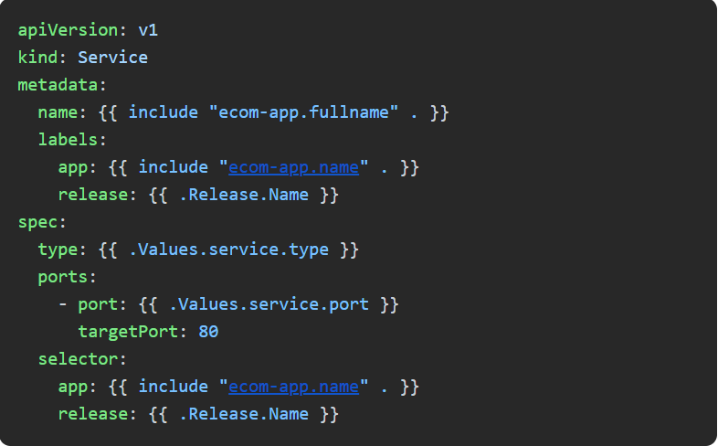

    ingress.yaml:

    - Ingress resources control external access to our services. This template handles the settings needed to expose our application outside the Kubernetes cluster.

    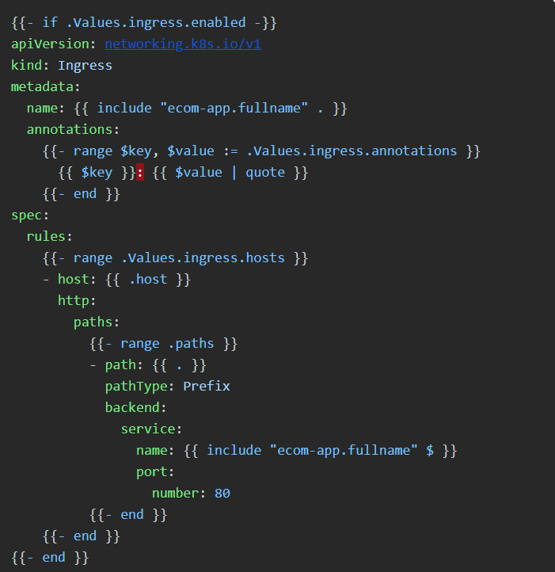

    pvc.yaml:

    - This template defines the PersistentVolumeClaim, which is used to request storage resources in Kubernetes.

    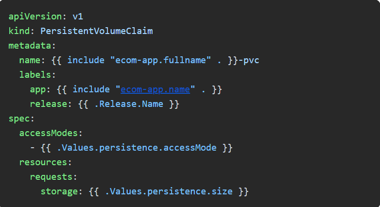

    _helpers.tpl:

    - This file contains reusable code snippets. It helps keep our templates DRY (Don't Repeat Yourself) by providing common functions.

    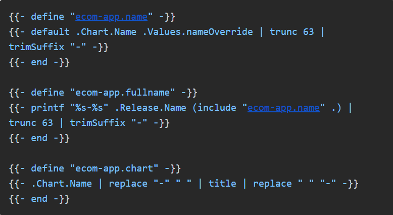

    values-eks.yaml:

    - These are the settings specific to EKS. They override the defaults in values.yaml to suit AWS's Kubernetes service.

    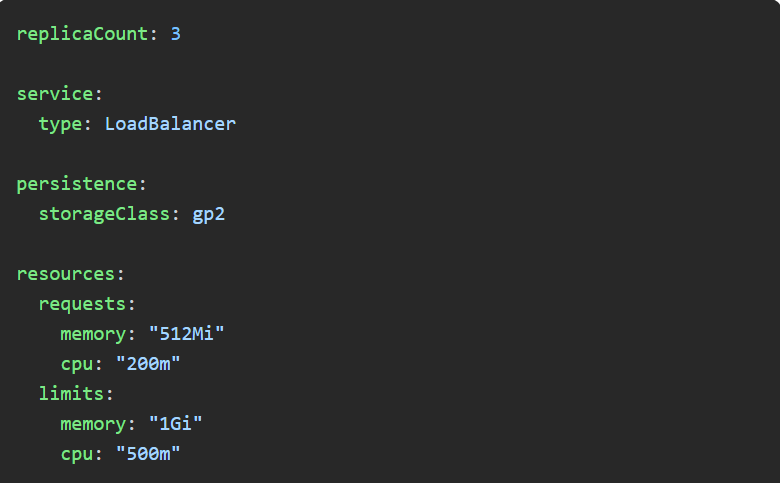

    values-gke.yaml:

    - Similarly, these are the settings specific to GKE. They make sure our application runs smoothly on Google's Kubernetes service.

    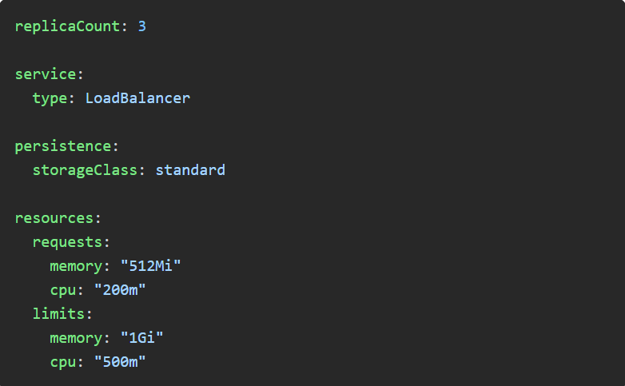

    - Ready to deploy? Here’s how you can get your e-commerce app up and running on both EKS and GKE.

    To deploy on EKS:

    
    
    To deploy on GKE:

    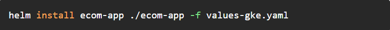

    - By using this structure and configuration, you can efficiently manage your Kubernetes deployments across both EKS and GKE with a single Helm chart.

                              📖 Resources & Tutorials

  * Kubernetes RBAC Best Practices and Tooling Collection *

    https://github.com/mhausenblas/rbac.dev?utm_source=www.techopsexamples.com&utm_medium=newsletter&utm_campaign=how-to-use-one-helm-chart-for-eks-and-gke&_bhlid=5efbd00e10051ef6ab4d3aa29a51822529bac77a

  * Useful Git Shortcuts and Autocomplete for Windows Bash Terminal *

    https://github.com/AndreiLucaci/git-shortcuts?utm_source=www.techopsexamples.com&utm_medium=newsletter&utm_campaign=how-to-use-one-helm-chart-for-eks-and-gke&_bhlid=cafcfcefe07c53fb776167161598dbdf3a405261

                              📈 Trends & Updates

  * Google Cloud Functions Flaw Exposes Sensitive Data * 

    https://thehackernews.com/2024/07/experts-expose-confusedfunction.html?utm_source=www.techopsexamples.com&utm_medium=newsletter&utm_campaign=how-to-use-one-helm-chart-for-eks-and-gke&_bhlid=5bb0dab550763c1413a47a8291f6cf15c6b90b49 

    The ConfusedFunction vulnerability in Google Cloud Functions allows attackers to escalate privileges and access sensitive data. Google's recent updates mitigate the issue for new deployments, but existing instances remain vulnerable.

  * Red Hat OpenShift GitOps 1.12: Key Updates and Enhancements *

    https://docs.redhat.com/zh_hans/documentation/red_hat_openshift_gitops/1.12/pdf/release_notes/red_hat_openshift_gitops-1.12-release_notes-en-us.pdf?utm_source=www.techopsexamples.com&utm_medium=newsletter&utm_campaign=how-to-use-one-helm-chart-for-eks-and-gke&_bhlid=2d7ebd25b0fb13163a78d258c05ae61c9e633b49

    The 1.12 release of Red Hat OpenShift GitOps introduces ArgoCD CLI support, enhanced NotificationsConfiguration, and critical fixes for TLS policies and secure authentication. These updates improve automation, security, and user experience for cloud-native deployments.

  * Critical Flaw in Docker Engine Allows Authorization Bypass

    https://thehackernews.com/2024/07/critical-docker-engine-flaw-allows.html?utm_source=www.techopsexamples.com&utm_medium=newsletter&utm_campaign=how-to-use-one-helm-chart-for-eks-and-gke&_bhlid=d2713ca5994f518bdc02224b49792cfa9d199b7e

    Docker has identified a critical vulnerability, CVE-2024-41110, allowing attackers to bypass authorization plugins and escalate privileges in certain versions of Docker Engine. With a maximum CVSS score of 10.0, this flaw has been patched in recent updates, and users are urged to upgrade to prevent potential exploits.

      

      

     
