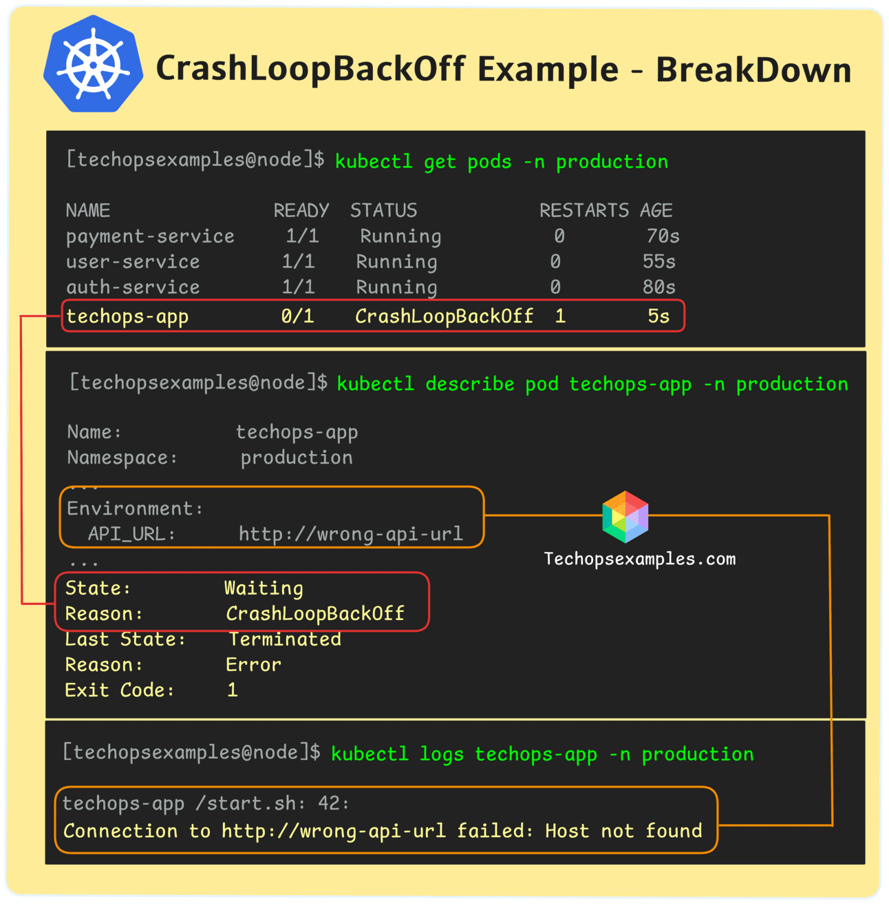
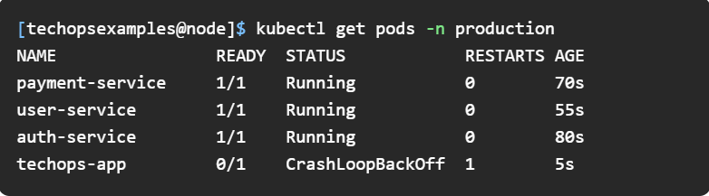
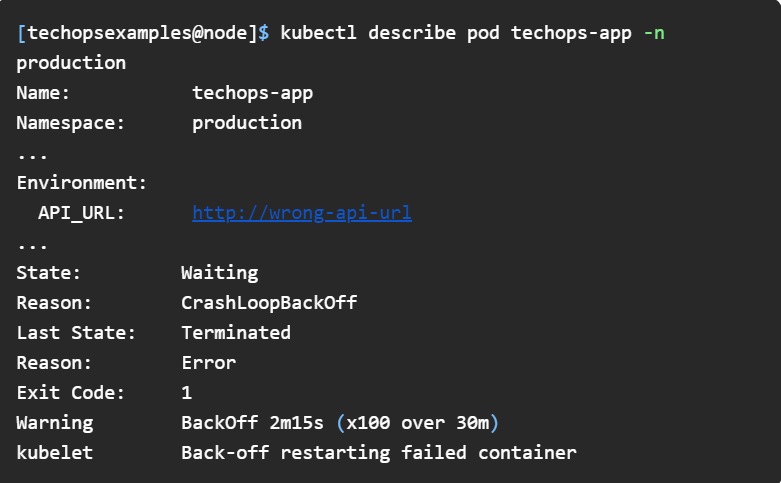
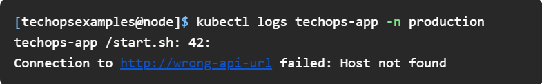

Kubernetes crashloopbackoff Example

  Today’s Agenda :

    Kubernetes CrashLoopBackOff Break Down

    A GenAI-powered Kubetools Recommender System

    How to secure an S3 bucket on AWS?

    AWS CodeCommit Closes to New Customers

    OpenTofu and Azure DevOps Feature releases

  Kubernetes Crashloopbackoff Break Down    

  Ever had one of those days when everything seems fine, but there's that one irritating pod that just won't stay up?

  The most common Kubernetes issue that can really test your patience: the CrashLoopBackOff.

What is it?

Simply put, CrashLoopBackOff is a status message indicating that a pod is failing to start repeatedly. It's Kubernetes' way of telling you, "Hey, something's wrong, and I'm giving it a break before I try again."

What factors cause it?

 A variety of issues can trigger a CrashLoopBackOff, such as:

 Application bugs, like unhandled exceptions or critical logic failures, prevent proper startup.

 Misconfigured volume mounts result in the application not finding necessary files or directories.

 Incorrect environment variables that lead to startup failures, such as specifying a wrong API URL.

 Dependencies that are unavailable due to network issues or incorrect DNS settings can cause crashes.

 Resource constraints, where insufficient CPU or memory allocation hinders the pod's ability to start.

 Missing config maps or secrets can prevent the application from accessing required configuration or credentials.

 Let’s breakdown this example:

  

The problem lies in the environment variable configuration:

  

The API_URL is set incorrectly, causing the application to fail at startup.

How to detect it?

  1.You'll notice the CrashLoopBackOff pod status:

  

  2.Describe the pod to get more details:

   

  3.Check the logs for specific errors:

   

 now you see, the root cause is ‘incorrect API URL’

 How to rollout the fix ?

  1.Set the environment variable to point to the correct API URL:

   

  2.Redeploy the application:

   

   And the pod should be up and running !

Realistically, you may not be able to avoid this completely but it can be prevented to a great extent when:

  You validate environment variables before deploying with tools like dotenv-linter 

  You set up monitoring and alerting using Prometheus and Grafana, with alerting rules.

  You implement readinessProbe and livenessProbe in your pod specs to detect and restart unhealthy containers.

  You ensure sufficient CPU and memory allocation by defining resources.requests and resources.limits, and use VPA.

                             Resources & Tutorials

        * A GenAI-powered Kubetools Recommender System *
          https://github.com/kubetoolsca/krs?utm_source=www.techopsexamples.com&utm_medium=newsletter&utm_campaign=kubernetes-crashloopbackoff-example

         KRS (Kubetools Recommender System) uses AI to recommend the best Kubernetes tools by scanning your cluster, detecting tools, and providing health checks. It supports OpenAI and Hugging Face models for interactive troubleshooting and recommendations.

       * How to secure an S3 bucket on AWS? *
         https://snyk.io/blog/secure-s3-bucket-on-aws/?utm_source=www.techopsexamples.com&utm_medium=newsletter&utm_campaign=kubernetes-crashloopbackoff-example

        This blog covers practical steps, including understanding S3 bucket vulnerabilities, best practices for security, and using tools like Snyk to automate security measures.      

                           Trends & Updates

       * AWS CodeCommit Closes to New Customers – Existing Users Unaffected *
        https://aws.amazon.com/blogs/devops/how-to-migrate-your-aws-codecommit-repository-to-another-git-provider/?utm_source=www.techopsexamples.com&utm_medium=newsletter&utm_campaign=kubernetes-crashloopbackoff-example

        Customers can move their AWS CodeCommit repositories to other Git providers by cloning or mirroring them. The blog offers step-by-step instructions for migrating to GitLab, GitHub, and other providers, ensuring all branches and tags are transferred successfully.

       * OpenTofu 1.8.0 Released with New Features and Future Plans *
        https://opentofu.org/blog/opentofu-1-8-0/?utm_source=www.techopsexamples.com&utm_medium=newsletter&utm_campaign=kubernetes-crashloopbackoff-example

        This release includes early evaluation, provider mocking, and a new .tofu file extension for better functionality. It reduces code duplication and makes projects easier to maintain with dynamic variable assignments. Future updates will add dynamic provider configurations and more community-driven improvements.

       * Azure DevOps Adds GitHub Branch Creation from Work Items *
        https://devblogs.microsoft.com/devops/update-on-azure-boards-github-integration/?utm_source=www.techopsexamples.com&utm_medium=newsletter&utm_campaign=kubernetes-crashloopbackoff-example

        Now you can create GitHub branches directly from work items in Azure DevOps, making your workflow smoother. Enhanced repository search makes connecting to projects with many repositories easier. AB# links in GitHub pull requests help you find related work items quickly.