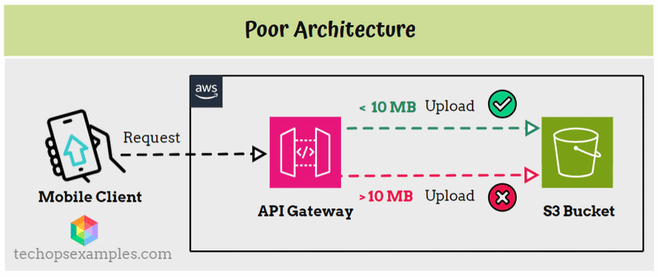
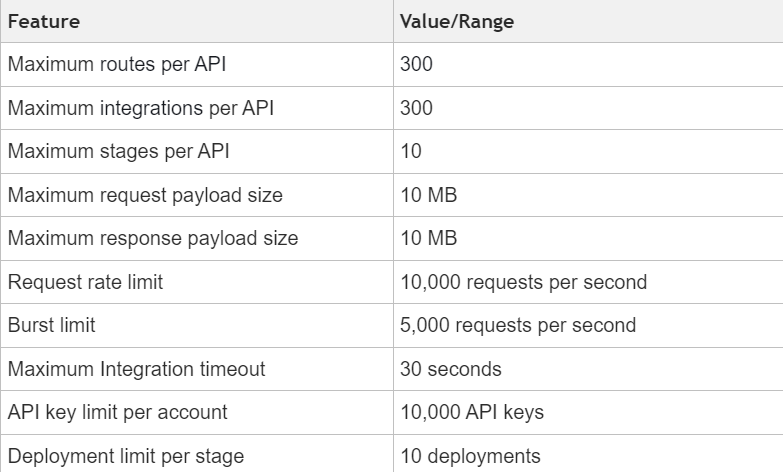

Architecture to Overcome API Gateway Pay Load Limit
  
  Today’s Agenda :

   Architecture to Overcome API Gateway Pay Load Limit

   Deploying Apps to EKS with GitHub Actions and ArgoCD

   Reimagining cloud strategy for AI-first enterprises

   Docker Desktop 4.33 Introduces Build Checks for Optimized Dockerfiles

   Google Adds Gemini AI to BigQuery and Looker to Simplify Data Tasks

   Microsoft to Explore Kernel Access Alternatives Post-CrowdStrike Outage

- Architecture to Overcome API Gateway Pay Load Limit

   Today's use case is about "Overcoming AWS API Gateway Payload Limits" with an ideal architecture example.

   Imagine you're developing a document management mobile app, where users can upload large files such as PDFs, presentations, and spreadsheets. The app needs to store these documents securely and efficiently.

  For this, utilizing AWS services like API Gateway and S3 is an ideal choice due to their scalability, security, and ease of integration.

  A mobile client can directly upload files to an S3 bucket via API Gateway, as depicted below:

  

  While this might seem straightforward, it has a critical limitation: API Gateway imposes a payload size limit of 10MB.

In this setup:

  Mobile Client sends a request to API Gateway.

  API Gateway attempts to upload the file to S3 Bucket.

  Files under 10MB succeed, while those over 10MB fail.

This architecture is not only inefficient but also unsuitable for applications dealing with larger files.
  
Key considerations for API Gateway:

- Have you heard about Pre-Signed URLs?

A pre-signed URL is a URL that you can provide to your users to grant temporary access to a specific S3 bucket. With this URL, users can upload files directly to S3 without requiring AWS credentials or going through an intermediary service like API Gateway.

Pre-signed URLs are time-limited and can be configured to allow only specific actions (like uploads), ensuring secure and controlled access to your S3 buckets.

Let's transition to a better architecture as below:

.gif>)

In this setup:

 obile Client sends a request to API Gateway.

 API Gateway invokes a Lambda Function.

 Lambda Function generates a pre-signed URL for the S3 bucket.

 Lambda Function returns the pre-signed URL to API Gateway.

 API Gateway forwards the pre-signed URL to the Mobile Client.

 Mobile Client uses the pre-signed URL to upload the file directly to S3 Bucket.

Why is this the Better Choice?

This improved architecture offers several benefits:

 No File Size Limitations: By allowing direct uploads to S3, the file size constraints of API Gateway are eliminated.

 Enhanced Performance: Direct uploads reduce latency and improve the overall performance of the file upload process.

 Scalability: This architecture can handle a larger number of uploads without additional complexity.

 Security: Pre-signed URLs ensure that only authorized users can upload files, maintaining security without sacrificing convenience.

This way, you ensure a seamless, scalable, and efficient file upload process for your mobile app, enhancing user experience and operational efficiency.

                                📖 Resources & Tutorials

- Deploying Apps to EKS with GitHub Actions and ArgoCD: Best Practices and Techniques

https://dev.to/devsatasurion/deploying-applications-with-github-actions-and-argocd-to-eks-best-practices-and-techniques-4epc?utm_source=www.techopsexamples.com&utm_medium=newsletter&utm_campaign=architecture-to-overcome-api-gateway-pay-load-limit&_bhlid=74e6a7442f6b97802ca7b7ac268c676eede8d642

This blog explains how to use GitHub Actions and ArgoCD to deploy applications on Amazon EKS, focusing on key techniques to simplify CI/CD workflows. It includes steps for setting up EKS clusters, configuring ArgoCD, and connecting GitHub repositories for smooth deployments.

- Reimagining cloud strategy for AI-first enterprises

https://www.technologyreview.com/2024/07/31/1094228/reimagining-cloud-strategy-for-ai-first-enterprises/?utm_source=www.techopsexamples.com&utm_medium=newsletter&utm_campaign=architecture-to-overcome-api-gateway-pay-load-limit&_bhlid=cac21f915d0199afd96c2f08de95c20a1c79cff0

MIT Technology Review Insights explores how AI advancements are transforming businesses. While AI shows significant benefits, achieving its full potential requires substantial cloud infrastructure investment.

                              📈 Trends & Updates

- Docker Desktop 4.33 Introduces Build Checks for Optimized Dockerfiles

https://www.docker.com/blog/introducing-docker-build-checks/?utm_source=www.techopsexamples.com&utm_medium=newsletter&utm_campaign=architecture-to-overcome-api-gateway-pay-load-limit&_bhlid=8746538608f368ab052d948735bb8fcd8c9a1fad

Docker Desktop 4.33 now features Docker Build checks, helping developers follow best practices for building container images. These checks provide real-time feedback, identify issues early, and improve build performance. Developers can access these checks through both the CLI and Docker Desktop Builds view.

- Google Adds Gemini AI to BigQuery and Looker to Simplify Data Tasks

https://www.infoworld.com/article/3480364/google-adds-gemini-to-bigquery-looker-to-help-with-data-engineering.html?utm_source=www.techopsexamples.com&utm_medium=newsletter&utm_campaign=architecture-to-overcome-api-gateway-pay-load-limit&_bhlid=d67dc9385139d9f8d62e609c9de04e8fa52db297

Google Cloud introduces its AI chatbot Gemini into BigQuery and Looker, helping data professionals with code generation, data analysis, and performance optimization. This enhancement aims to make data engineering tasks easier and more efficient. Additionally, BigQuery now supports Apache Spark and Kafka for better real-time data analysis.

- Microsoft, SecOps pros Explore Kernel Access Alternatives Post-CrowdStrike Outage

https://www.techtarget.com/searchitoperations/news/366599066/Microsoft-SecOps-pros-weigh-kernel-access-post-CrowdStrike?utm_source=www.techopsexamples.com&utm_medium=newsletter&utm_campaign=architecture-to-overcome-api-gateway-pay-load-limit&_bhlid=d03092bf8d1a2c105d5d8277ed6d5663c933c066

Following a major outage caused by a CrowdStrike update, Microsoft plans to seek alternatives to direct kernel access for partners. The incident, which affected 8.5 million Windows systems, has sparked debate among SecOps professionals about the necessity and risks of kernel access. Potential alternatives, such as VBS enclaves and Azure Attestation, aim to enhance system security and resilience.

