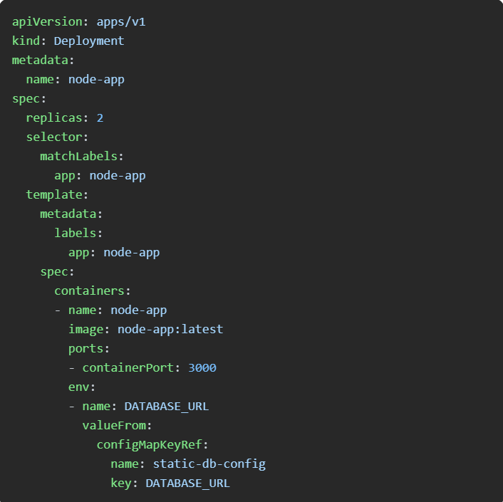
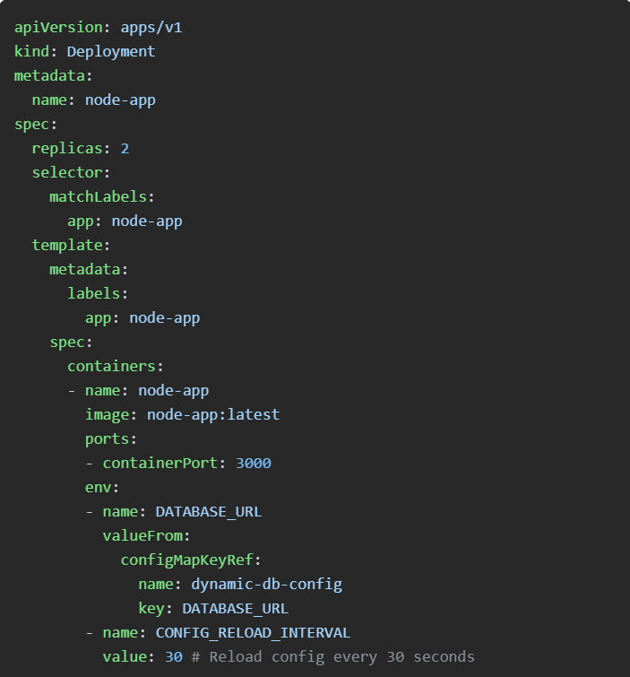

# Kubernetes Static Vs Dynamic Config Maps

Today’s Agenda :
Kubernetes Static Vs Dynamic Config Maps

Convert Cloud Infrastructure to Terraform Code

Best practices for streamlining log centralization with Cloud Logging

AWS CodePipeline introduces stage level conditions

Azure announces general availability of Container Storage for Kubernetes

DigitalOcean Load Balancer: Scaling to 1,000,000+ Connections

Kubernetes Static Vs Dynamic Config Maps

Today's use case is all about Static vs. Dynamic Configurations in Kubernetes with a real-world example to show you how to keep your deployments up-to-date with the latest changes.

To begin with, what is a ConfigMap?

It's an API object in Kubernetes used to store non-confidential configuration data as key-value pairs, enabling the decoupling of configuration artifacts from image content for better application portability.

When distinguishing between static and dynamic ConfigMaps in Kubernetes, it's all about management and updates.

Static ConfigMaps are created and updated manually, requiring users to reapply changes and possibly restart pods to apply the new configurations.

Dynamic ConfigMaps are more hands-off, updating automatically from external sources or through processes that refresh the running pods without the need for restarts. This allows for smoother and more efficient configuration management in dynamic environments.

As we see in the below example:

.jpg>)

Static configurations are simple and easy to implement but come with significant limitations.

No Real-time Updates: Any change in the configuration map requires a manual redeployment of the pods to pick up the changes.

Downtime: Manually updating configurations can lead to downtime or inconsistent states during the deployment process.

Scalability: Managing configurations manually does not scale well, especially in large and dynamic environments.

A static configuration looks like this, watch out of ‘configMapKeyRef’ :

To overcome these limitations, dynamic configurations allow your deployments to pick up changes in real-time without requiring a manual redeployment.

A dynamic configuration looks like this with a CONFIG_RELOAD_INTERVAL :

Points to Consider Before Implementing Dynamic Configs:

Application Compatibility: Ensure your application can handle configuration changes at runtime without requiring a restart.

Security: Dynamic updates might introduce security risks if sensitive configurations are exposed or not properly validated.

Performance Overhead: Continuously checking for updates might introduce some performance overhead; evaluate the impact on your application.

Testing: Thoroughly test dynamic configurations in a staging environment to catch potential issues before rolling them out to production.

Logging and Monitoring: Implement robust logging and monitoring to track configuration changes and quickly identify any issues caused by updates.

Remember, Kubernetes and peace of mind usually don't go hand in hand, but with dynamic configurations, at least we try not to lose a day of sleep on upgrade days :)

                              📖 Resources & Tutorials

Convert Cloud Infrastructure to Terraform Code

https://github.com/cycloidio/terracognita?utm_source=www.techopsexamples.com&utm_medium=newsletter&utm_campaign=kubernetes-static-vs-dynamic-config-maps&_bhlid=2beb5240839a5b8fefd8508aa8755988b2e8fc33

Terracognita by Cycloid automates the conversion of existing cloud infrastructure into Terraform code, streamlining the transition to Infrastructure as Code (IaC). Supporting AWS, GCP, Azure, and VMware.

Best practices for streamlining log centralization with Cloud Logging

https://cloud.google.com/blog/products/devops-sre/how-to-centralize-log-management-with-cloud-logging?utm_source=www.techopsexamples.com&utm_medium=newsletter&utm_campaign=kubernetes-static-vs-dynamic-config-maps&_bhlid=a4e7cd31a556198a3658ec26858e8bcfa935e5cb

Centralizing log management with Cloud Logging enhances system visibility, security, and efficiency. By aggregating logs, setting up a central observability project, and customizing storage, you streamline operations and reduce costs.

                             📈 Trends & Updates

AWS CodePipeline introduces stage level conditions to implement pipeline gates

https://aws.amazon.com/about-aws/whats-new/2024/08/aws-codepipeline-stage-level-conditions-implement-pipeline-gates/?utm_source=www.techopsexamples.com&utm_medium=newsletter&utm_campaign=kubernetes-static-vs-dynamic-config-maps&_bhlid=4cb6dcc8345265e4a7d0da8629172ac476a37513

AWS CodePipeline now supports stage-level conditions, allowing teams to enforce quality and compliance checks at critical points in the pipeline. Configure conditions to gate pipeline executions based on CloudWatch alarms, time windows, or custom AWS Lambda functions.

Azure announces general availability of Container Storage for Kubernetes

https://azure.microsoft.com/en-us/blog/embrace-the-future-of-container-native-storage-with-azure-container-storage/?utm_source=www.techopsexamples.com&utm_medium=newsletter&utm_campaign=kubernetes-static-vs-dynamic-config-maps&_bhlid=dd96334a3aef9f7d8b3d8185198ca68dbf3c91c1

Microsoft's Azure Container Storage is now generally available, offering the first platform-managed container-native storage service in the public cloud. This service, integrated with Azure Kubernetes Service (AKS), simplifies managing stateful workloads with high performance and low latency and it supports ephemeral disks and Azure Disks.

DigitalOcean Load Balancer: Scaling to 1,000,000+ Connections

https://www.digitalocean.com/blog/load-balancer-scaling-to-1000000-connections?utm_source=www.techopsexamples.com&utm_medium=newsletter&utm_campaign=kubernetes-static-vs-dynamic-config-maps&_bhlid=712aa98ee849f62123d5f21d040af32cf6dfb82f

DigitalOcean's revamped Load Balancer architecture scales to over 1 million connections, ensuring high availability and consistent performance. By leveraging a passthrough network load balancer (NLB) and BGP/ECMP.
