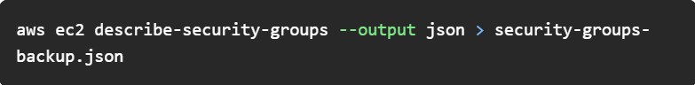

## AWS Security Groups Common Error Codes and Resolutions

### Today’s Agenda :
AWS Security Groups Common Error Codes and Resolutions

300+ DevOps Tasks covering Cloud, Containers, IaC etc

Automating Databases for Modern DevOps Practices

State of Kubernetes Security 2024 Snapshot

Accelerate your Terraform development with Amazon Q Developer

Survey Finds Speed of Software Deployment Outpacing Security

   ### AWS Security Groups Common Error Codes and Resolutions

he most frequent and helpless scenarios were often caused by security group mess-ups.

These misconfigurations can cause issues from server inaccessibility to security breaches, so correct security group configuration is essential for a secure, functional cloud environment.

Here, I provide a breakdown of common error codes related to security groups, along with their contexts and solutions:

.png>)

### Security Groups Tips and Tricks:

  Use specific CIDR blocks to limit access to trusted IP ranges only.

  Regularly review and clean up unused or obsolete security group rules.

  Apply inbound and outbound rules judiciously to reduce attack surface.

  Leverage VPC flow logs to identify and monitor security group activities.

  Utilize IAM roles with security groups for enhanced access management and control.

  Enable detailed monitoring for security group changes to track and audit modifications.

  Use tags to organize and manage security groups efficiently within your AWS environment.

  Implement least privilege principle by allowing minimal access required for functionality.

  Integrate AWS WAF with security groups for additional layer of protection against common web exploits.

  Automate security group rule updates using AWS Lambda and CloudWatch Events for real-time threat response.

### How to Take a Security Groups Backup:

You can use the AWS CLI. Here’s an example command to export the current security group configurations to a JSON file:

                   

        A multi-tenancy and policy-based framework for Kubernetes

                             📖 Resources & Tutorials

#### 300+ DevOps Tasks covering Cloud, Containers, IaC etc

https://github.com/codeaprendiz/learn_devops?utm_source=www.techopsexamples.com&utm_medium=newsletter&utm_campaign=aws-security-groups-common-error-codes-and-resolutions&_bhlid=ede85c340be4fc3b1abf840df923a15d530b3cbc

A repository documented the devops journey. Every task has an associated objective that encompasses an underlying concept. Concepts including CloudProviders, Containers, ContainersOrchestration, Databases, InfrastructureAsCode, Interview, VersionControl etc

#### Automating Databases for Modern DevOps Practices

https://dzone.com/articles/automating-databases-for-modern-devops-practices?utm_source=www.techopsexamples.com&utm_medium=newsletter&utm_campaign=aws-security-groups-common-error-codes-and-resolutions&_bhlid=972303774b6705bc5234bea0750018202f2b2109

The article discusses the importance of database automation in modern DevOps practices, highlighting methods like Infrastructure as Code, CI/CD implementation, and automated monitoring. It emphasizes the benefits of automating database operations, such as improved efficiency and reduced errors.

                            📈 Trends & Updates

#### State of Kubernetes Security 2024 Snapshot

https://www.armosec.io/blog/unraveling-the-state-of-kubernetes-security-2024/?utm_source=www.techopsexamples.com&utm_medium=newsletter&utm_campaign=aws-security-groups-common-error-codes-and-resolutions&_bhlid=236fdd4858dcb05aa30d05798cea18c27aca3fff

The 2024 Red Hat State of Kubernetes Security report reveals decreasing concerns about misconfigurations and increasing worries about vulnerabilities, emphasizing the importance of continuous security scanning and DevSecOps practices.

### Automating Databases for Modern DevOps Practices

https://dzone.com/articles/automating-databases-for-modern-devops-practices?utm_source=www.techopsexamples.com&utm_medium=newsletter&utm_campaign=aws-security-groups-common-error-codes-and-resolutions&_bhlid=972303774b6705bc5234bea0750018202f2b2109

The blog demonstrates how Amazon Q Developer, a generative AI-powered assistant, enhances Terraform development by generating code snippets for various AWS services like VPCs, CI/CD pipelines, event-driven architectures, ECS with Fargate, and SageMaker workflows.

#### Survey Finds Speed of Software Deployment Outpacing Security

https://devops.com/survey-finds-speed-of-software-deployment-outpacing-security/?utm_source=www.techopsexamples.com&utm_medium=newsletter&utm_campaign=aws-security-groups-common-error-codes-and-resolutions&_bhlid=1b1f82999ff101c30bd8cb27d3b37b2199f50264

A survey by Omdia for GitLab reveals that 66% of developers and IT professionals are releasing software faster than a year ago, with 24% pushing code to production daily. Despite this speed, security practices lag, with only 38% of security professionals shifting security left and 34% providing security training to developers.

