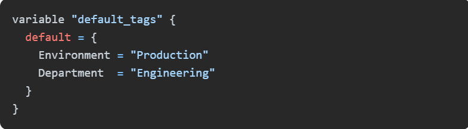
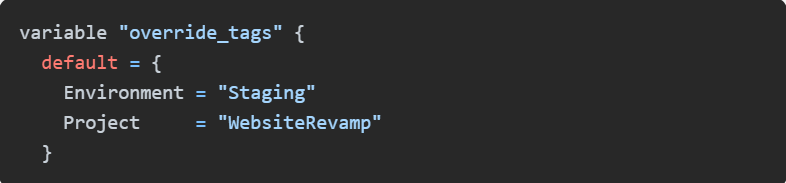
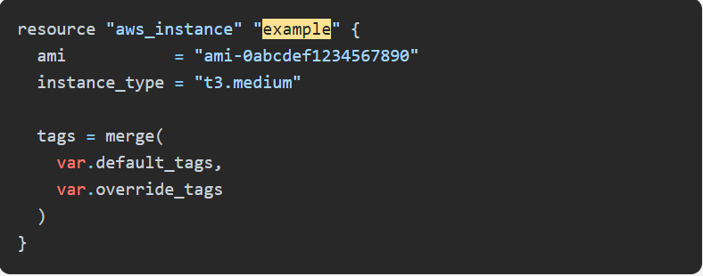
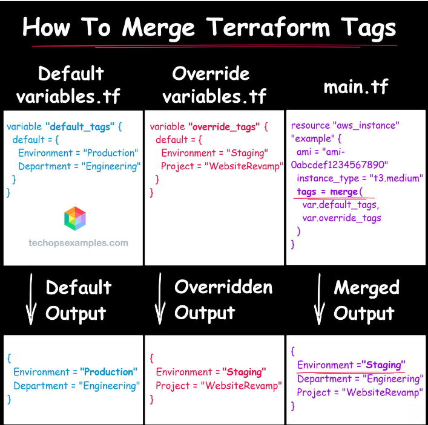
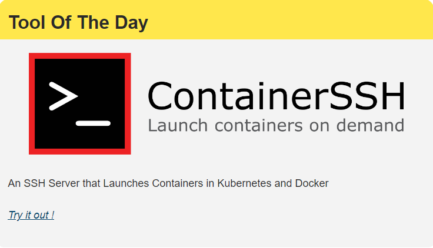

### How To Merge Terraform Tags

Did you know the first computer virus was created in 1986? It was called Brain and was written to protect software from piracy.

##### In this issue :

How To Merge Terraform Tags

Visual Studio Code 1.92 is out now - What’s different this time ?

GitHub Copilot: Productivity boost or DORA metrics disaster?

GitOps for CloudFront and S3 walkthrough

Extended validation for Terraform in the form of a custom provider

How AWS Aurora is Used in an Online Social Media Platform

###### TERRAFORM

How To Merge Terraform Tags

.jpg>)

To begin with, why tag resources?

Of course, the show can be run even without the tags. However, when you use them, it:

Helps in better organization by categorizing resources based on criteria like environment, application, and team.

Aids in cost allocation, enabling more effective tracking of expenses across different projects or departments.

Simplifies automation processes by making it easier to manage and deploy resources programmatically.

Enhances security by allowing you to identify and control access to resources based on tags.

Achieves efficient lifecycle management as tags help track the usage and status of resources throughout their lifespan.

Having said that, How to Define Default Tags in Terraform ?

Defining default tags in Terraform is a great way to promote consistency and save yourself from repetitive work.

You can set these tags at the provider level, which then apply to all resources managed by that provider.

Check this example:

What’s next ? Let’s see how to override tags at the resource level ?

Sometimes, you need to override those default tags or add new ones for specific resources.

This can be done by specifying the tags argument within the resource definition.

For example:

##### How to Merge Default and Override Tags ?

Terraform allows you to merge default and override tags using the merge function.

This is useful for combining tags from different sources.

Here’s an example of how to do this:

The merged output will include the overridden and additional tags while retaining the default ones that are not overridden.

I would also like to share how to avoid common tagging pitfalls ?

1. Inconsistent tag naming conventions can make tags harder to manage - Stick to a clear naming convention.

2. Having identical tag keys and values in both default and resource tags can cause errors in Terraform.

3. Partial tag matches between default and resource tags can result in perpetual diffs during Terraform plan.

Remember,

Tagging makes tracking easier.

If done incorrectly, the benefit itself becomes an impediment.

##### Tool Of The Day

https://containerssh.io/v0.5/?utm_source=www.techopsexamples.com&utm_medium=newsletter&utm_campaign=how-to-merge-terraform-tags&_bhlid=0aea3233fde4ddf35f3c8898f3ce9135aa9a09a7

#### Trends & Updates

###### Visual Studio Code 1.92 is out now - What’s different this time ?

Microsoft's Visual Studio Code 1.92 enhances debugging with new accessibility features and allows developers to configure their preferred browser for opening links. The update also introduces improved control over extension updates, including options for auto-updating all or individual extensions.

https://code.visualstudio.com/updates/v1_92

###### GitHub Copilot: Productivity boost or DORA metrics disaster?

The article discusses how AI tools like GitHub Copilot can boost productivity but may negatively impact DORA metrics due to increased bugs and security issues. It highlights the need for rigorous code reviews, security checks, and automated testing to maintain high-quality software development despite AI's influence.

https://www.infoworld.com/article/3479652/github-copilot-productivity-boost-or-dora-metrics-disaster.html?utm_source=www.techopsexamples.com&utm_medium=newsletter&utm_campaign=how-to-merge-terraform-tags&_bhlid=3757c81b5d7a27d9269613861ef878f6e5965551

##### Resources & Tutorials

###### GitOps for CloudFront and S3 Walkthrough

The blog explains how to use ArgoCD, EKS, AWS CloudFront, and S3 to make front-end deployments easier and more efficient with GitOps. It describes using GitHub Actions for building and deploying, and a Kubernetes job with AWS CLI to keep CloudFront paths updated for smooth application delivery.

https://dev.to/wardove/gitops-for-cloudfront-and-s3-5c7o?utm_source=www.techopsexamples.com&utm_medium=newsletter&utm_campaign=how-to-merge-terraform-tags&_bhlid=9a8241ab45224068bc2687a806239d87146e5d69

###### Extended validation for Terraform in the form of a custom provider

This GitHub repo improves Terraform by adding a custom provider that checks if your settings are correct before applying them. It includes features to stop the process if there's a problem or to warn you about potential issues.

https://github.com/tlkamp/terraform-provider-validation?utm_source=www.techopsexamples.com&utm_medium=newsletter&utm_campaign=how-to-merge-terraform-tags&_bhlid=32bd87f3267c811c67249be6bf5a1169d7e22a81

###### How AWS Aurora is Used in an Online Social Media Platform

This article highlights AWS Aurora's benefits for scalable and reliable database management, including high performance, durability, and cost efficiency. It also provides a real-life example of how an online social media platform uses Aurora to handle high traffic and ensure data integrity.

https://dzone.com/articles/aws-aurora-for-scalable-and-reliable-databases?utm_source=www.techopsexamples.com&utm_medium=newsletter&utm_campaign=how-to-merge-terraform-tags&_bhlid=f3822b55e82b6da942269fd52779937b630f2ef1

