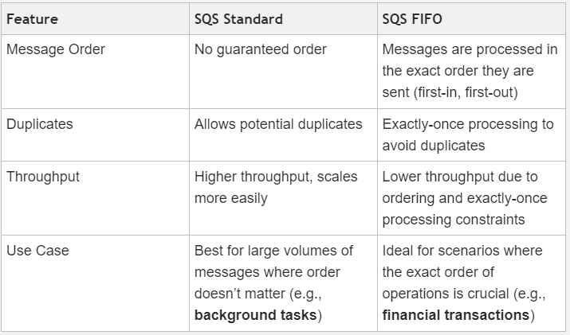
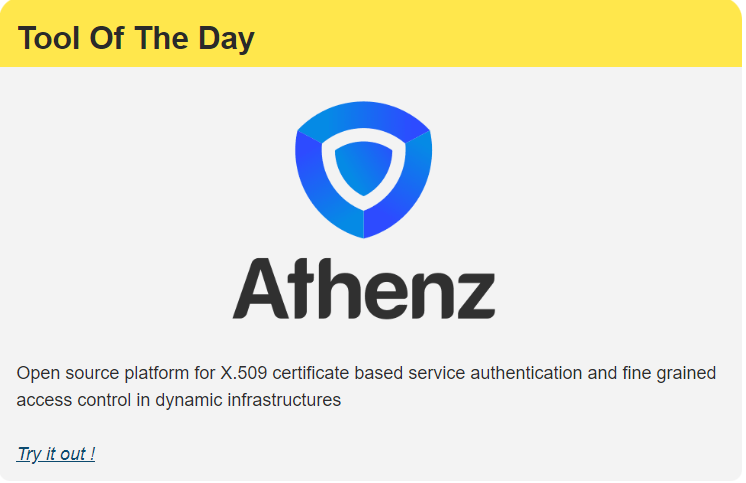

#### AWS Lambda Integration Patterns with SQS and SNS

💡 Did you know that AWS once used shipping containers to speed up data transfers? In 2009, they launched "AWS Import/Export," allowing customers to physically send storage devices to AWS data centers, bypassing the internet for faster massive data uploads.

###### In this issue :

AWS Lambda Integration Patterns with SQS and SNS

CloudBees Acquires Launchable to Boost Iterative Development

Usage of AI Rapidly Expands Once DevOps Teams Adopt

How to use Linux package managers

Infrastructure as Code Landscape Overview 2024

Continuous Delivery on Google Cloud with Gitlab CI/CD and Cloud Deploy

##### AWS LAMBDA

##### AWS Lambda Integration Patterns with SQS and SNS

.jpg>)

Asynchronous communication in AWS lets different parts of a system talk to each other without having to wait for a response, making the system more efficient and able to handle more tasks at the same time.

SQS (Simple Queue Service) and SNS (Simple Notification Service) are widely used for managing asynchronous communication in AWS.

SQS holds messages until they're ready to be processed, while SNS broadcasts messages to multiple places instantly. This setup helps keep the system responsive and flexible.

While using SQS, it's also important to understand the existence of SQS FIFO, which is designed for specific use cases.

How they differ from each other:

In short,

SQS is ideal for general messaging where high throughput is needed, and strict order isn’t critical.

SQS FIFO is better suited for applications where it’s important that messages are processed in the exact order they are sent, and no duplicates are allowed.

In this context, you should also be aware of the DLQ 💀 

A Dead Letter Queue (DLQ) is a special queue that captures messages that fail to be processed after multiple attempts. It's used for further investigation to prevent data loss and ensure that problematic messages can be addressed without affecting the overall system.

Let's look at how Lambda can be integrated for asynchronous communication.

Here are three main patterns we'll cover:

SQS + Lambda

SQS FIFO + Lambda

SNS + Lambda

Here’s how each pattern works:

###### 1. SQS + Lambda :

.gif>)

Step 1: SQS stores messages in a queue, and Lambda checks the queue to process each message.

Step 2: If something goes wrong during processing, SQS retries the message.

Step 3: If the message keeps failing, it gets moved to a Dead Letter Queue (DLQ) for further investigation.

💡This pattern is particularly beneficial for processing user uploads or logs in a web application, ensuring the system handles each task efficiently even under heavy load.

###### 2. SQS FIFO + Lambda :

.gif>)

Step 1: SQS FIFO makes sure messages are processed in the exact order they were sent.

Step 2: Lambda processes each message one by one in that order.

Step 3: If a message fails after several attempts, it is moved to a DLQ for further action.

💡This pattern is vital for applications like e-commerce order processing, where processing orders in the exact sequence they are received is essential to maintaining consistency and accuracy.

###### 3. SNS + Lambda :

.gif>)

Step 1: SNS sends notifications to Lambda function(s) as soon as something happens.

Step 2: The Lambda functions handle these notifications in real-time.

Step 3: If something goes wrong, Lambda retries the task, and if it still fails, the message is sent to an SQS queue or DLQ for further action.

💡This pattern is especially effective for real-time monitoring systems, where immediate notification and processing are crucial, such as alerting multiple teams about a system failure.

#### Tool Of The Day

https://www.athenz.io/?utm_source=www.techopsexamples.com&utm_medium=newsletter&utm_campaign=aws-lambda-integration-patterns-with-sqs-and-sns&_bhlid=6703aa1d1ea4b708c0240a2de7b951893e201deb

##### Trends & Updates

###### CloudBees Acquires Launchable to Boost Iterative Development

CloudBees has acquired Launchable to integrate its AI-augmented test optimization, which reduces test cycles by 90% and saves over 2,000 hours monthly, directly into Jenkins and other CloudBees platforms. This acquisition enhances CloudBees’ ability to improve test accuracy, and accelerate time-to-market for enterprise software.

https://www.cloudbees.com/blog/cloudbees-acquires-launchable-to-enable-development-teams-to-iterate-faster?utm_source=www.techopsexamples.com&utm_medium=newsletter&utm_campaign=aws-lambda-integration-patterns-with-sqs-and-sns&_bhlid=22fca0dbceb5e2e9faab0921cedd62d4b83f54af

###### Usage of AI Rapidly Expands Once DevOps Teams Adopt

A survey by Techstrong Research reveals that 20% of DevOps professionals now use AI across all phases of the SDLC, with 46% planning to adopt AI tools in the next year. The survey highlights increased efficiency, reduced skills gaps, and improved software quality as key benefits of AI adoption in DevOps.

https://devops.com/survey-usage-of-ai-rapidly-expands-once-devops-teams-adopt/?utm_source=www.techopsexamples.com&utm_medium=newsletter&utm_campaign=aws-lambda-integration-patterns-with-sqs-and-sns&_bhlid=614cefccdcb434de9d802ddbc7b5900b9978ddc6

#### Resources & Tutorials

###### How to use Linux package managers

Linux package managers, such as DNF, APT, and Zypper, are crucial for software installation, updates, and maintenance across various distributions like RHEL, Ubuntu, and SUSE. The article details their commands and functions, along with other tools like Flatpak and Snap, to guide Linux administrators in managing software packages effectively.

https://www.techtarget.com/searchitoperations/tip/How-to-use-Linux-package-managers?utm_source=www.techopsexamples.com&utm_medium=newsletter&utm_campaign=aws-lambda-integration-patterns-with-sqs-and-sns&_bhlid=41ab761d323fd14eb77113a88646ee82dc4ba48b

###### Infrastructure as Code Landscape Overview 2024

The blog provides an overview of the 2024 Infrastructure as Code (IaC) landscape, categorizing tools by functionality and language, from core provisioning tools like Terraform to emerging AI-centric and drag-and-drop interfaces. It highlights the crowded space, ongoing challenges, and opportunities for innovation in simplifying infrastructure management.

https://itnext.io/infrastructure-as-code-landscape-overview-2024-a066124e5989

###### Continuous Delivery on Google Cloud with Gitlab CI/CD and Cloud Deploy

A Continuous Delivery pipeline using Gitlab CI/CD and Google Cloud Deploy automates software deployment on Cloud Run. It involves setting up Gitlab integration with Google Cloud, building and pushing Docker images, deploying to QA and production stages, and managing rollouts with canary releases and approvals.

https://cloud.google.com/blog/products/devops-sre/software-delivery-pipelines-with-gitlab-cicd-and-cloud-deploy?utm_source=www.techopsexamples.com&utm_medium=newsletter&utm_campaign=aws-lambda-integration-patterns-with-sqs-and-sns&_bhlid=34d1def75c31e2c75dd57ccbc13214cc8f82e192