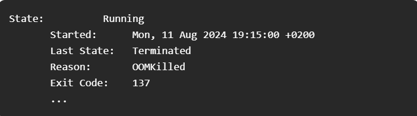
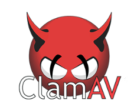

#### How To Fix OOMKilled

How To Fix OOMKilled

HashiCorp 2024 State of Cloud Strategy Report

Google Cloud launches BigQuery continuous queries

Adidas Reduced Kubernetes Cluster Costs by 50%

Bash Script to Install Multiple Helm Charts in One Go

Terraform Ephemeral Values Explained

###### Use Case
##### How To Fix OOMKilled

OOMKilled occurs in Kubernetes when a container exceeds its memory limit or tries to access unavailable resources on a node, flagged by exit code 137.

Typical OOMKilled looks like

"Pods must use less memory than the total available on the node; if they exceed this, Kubernetes will kill some pods to restore balance."

Learn more about OOMKilled visually here:

.jpg>)

               credit: perfectscale

###### How to Fix OOMKilled Kubernetes Error (Exit Code 137)

1. Identify OOMKilled Event: Run kubectl get pods and check if the pod status shows OOMKilled.

2. Gather Pod Details: Use kubectl describe pod [pod-name] and review the Events section for the OOMKilled reason.

Check the Events section of the describe pod, and look for the following message:

3. Analyze Memory Usage: Check memory usage patterns to identify if the limit was exceeded due to a spike or consistent high usage.

4. Adjust Memory Settings: Increase memory limits in pod specs if necessary, or debug and fix any memory leaks in the application.

5. Prevent Overcommitment: Ensure memory requests do not exceed node capacity by adjusting pod resource requests and limits.

##### Point worth noting:

"If a pod is terminate due to a memory issue. it doesn’t necessarily mean it will be removed from the node. If the node’s restart policy is set to ‘Always’, the pod will attempt to restart"

To check the QoS class of a pod, run this command:

 kubectl get pod -o jsonpath='{.status.qosClass}' 

To inspect the oom_score of a pod:

1. Run kubectl exec -it /bin/bash

2. To see the  oom_score, run cat/proc//oom_score

3. To see the  oom_score_adj, run cat/proc//oom_score_adj

The pod with the lowest oom_score is the first to be terminated when the node experiences memory exhaustion.

##### Tool Of The Day

An open-source antivirus engine for detecting trojans, viruses, malware & other malicious threats.

https://www.clamav.net/?utm_source=www.techopsexamples.com&utm_medium=newsletter&utm_campaign=how-to-fix-oomkilled&_bhlid=491a69dba769528937ea7bd8e8d5ce1bdceddf68

##### Trends & Updates

###### HashiCorp 2024 State of Cloud Strategy Report

The report reveals only 8% of organizations are highly cloud-mature, gaining stronger security and faster development. Key findings include 91% reporting cloud waste, 64% facing a skills shortage, and 79% using or planning multi-cloud deployments.

https://www.hashicorp.com/state-of-the-cloud?utm_source=www.techopsexamples.com&utm_medium=newsletter&utm_campaign=how-to-fix-oomkilled&_bhlid=75dba3eea75995688dad01ab60003f17ac866da4

###### Google Cloud launches BigQuery continuous queries

This new feature allows instant data processing, integrates with Google’s AI tools for real-time machine learning, and simplifies event-driven architectures, all within BigQuery.

https://cloud.google.com/blog/products/data-analytics/bigquery-continuous-queries-makes-data-analysis-real-time?utm_source=www.techopsexamples.com&utm_medium=newsletter&utm_campaign=how-to-fix-oomkilled&_bhlid=db4bfe581c3513e8887700392f8685c02bd9c68b

##### Resources & Tutorials

###### Adidas Reduced Kubernetes Cluster Costs by 50%

By automating resource scaling with Karpenter, enhancing efficiency with Kyverno-driven VPAs, and strategically downsizing during non-peak hours, all while tackling challenges like node underutilization and balancing application performance.

https://www.infoq.com/news/2024/07/adidas-kubernetes-cost-reduction/?utm_source=www.techopsexamples.com&utm_medium=newsletter&utm_campaign=how-to-fix-oomkilled&_bhlid=f5c9e7b6be62780769cc6090578dcce280456a84

###### Bash Script to Install Multiple Helm Charts in One Go

This article introduces "helmister," a lightweight bash script that automates the installation and uninstallation of multiple Helm charts, ideal for secure, air-gapped environments where simplicity and accessibility are key.

https://www.cncf.io/blog/2024/08/06/installing-multiple-helm-charts-in-one-go-approach-3-using-simple-bash-utility/?utm_source=www.techopsexamples.com&utm_medium=newsletter&utm_campaign=how-to-fix-oomkilled&_bhlid=0f7dfd5a458d3e1ea13ea7419dc4b1971330e204

###### Terraform Ephemeral Values Explained

Explore how ephemeral values in Terraform can minimize secret sprawl and enhance security by limiting the persistence of sensitive data, offering a fresh perspective on managing secrets and other transient resources effectively.

https://log.martinatkins.me/2024/05/22/terraform-ephemeral-values/?utm_source=www.techopsexamples.com&utm_medium=newsletter&utm_campaign=how-to-fix-oomkilled&_bhlid=bbd11f9493f21d8cdf4c77ae4d70cba92201bc61

