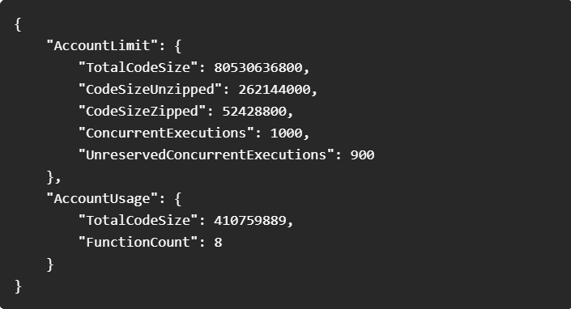

#### How Provisioned Concurrency Cut AWS Lambda Cold Starts by 98%

How Provisioned Concurrency Cut AWS Lambda Cold Starts by 98%

Sysdig Launches Cloud Identity Insights for Security

Stack Overflow Ranks Docker as Top Developer Tool

How Zesty Cut 40% in NAT Gateway Costs

Docker Best Practices: ADD vs. COPY in Dockerfiles

A Guide to Deploying Production-Ready HashiCorp Vault on EC2

#### Use Case

##### How Provisioned Concurrency Cut AWS Lambda Cold Starts by 98%

AWS Lambda cold starts occur when a function takes longer to start because the environment needs to be set up before running the code.

The Lambda execution environment lifecycle plays a crucial role in understanding cold starts.

When you invoke a Lambda function, AWS Lambda needs to create a secure, isolated environment where your code can run. This environment includes all the necessary resources such as memory, CPU, and the runtime for your function.

.jpg>)

Cold starts happen in the INIT phase because AWS Lambda has to create the environment from scratch. If no ready environments are available, Lambda needs time to set up everything before running the function, causing a delay in processing the first request. These delays are especially noticeable in high-demand applications.

###### "Provisioned Concurrency solves this by keeping a set number of instances of the function always warm and ready, reducing the startup time significantly."

As your function gets more requests at the same time, Lambda automatically increases the number of environments needed to run them.

.gif>)

                      Credit: AWS

Let's pause and time block the animation to see the breakdown clearly.

.png>)

t1: The first three requests (1, 2, 3) are initialized (Init) and invoked (Invoke), all experiencing a cold start.

t2: The fourth and fifth requests (4, 5) are initialized and invoked, also experiencing a cold start.

t3: Requests 6, 7, and 8 are invoked directly without initialization, benefiting from warm instances.

t4: Request 9 is initialized and invoked, while requests 6, 7 and 8 continue their execution. Request 10 is invoked on a warm instance.

t5: Requests 6, 7, 8, and 10 continue their execution. No new initialization occurs.

t6: The final executions for requests 9 and 10 wrap up, with no new actions initiated.

##### How Lambda Allocates Provisioned Concurrency ?

Provisioned concurrency takes a minute or two to become active after configuration. Lambda can provision up to 6,000 execution environments per minute per function, regardless of the AWS Region.

###### "When you request provisioned concurrency, none of the environments are accessible until all requested environments are fully allocated."

For instance, if you request 5,000, the provisioned concurrency is only available once all 5,000 environments are ready.

###### Concurrency Quotas

Default account concurrency limit: 1,000 units.

Function-level limit: 900 units (100 reserved for unreserved functions).

Requests per second limit: 10 times the concurrency quota.

To check your account's concurrency quota, run this AWS CLI command:

You’ll see output like this:

##### Tool Of The Day

A management plane that provides lifecycle, performance, and configuration management for service meshes in cloud-native environments.

https://meshery.io/?utm_source=www.techopsexamples.com&utm_medium=newsletter&utm_campaign=how-provisioned-concurrency-cut-aws-lambda-cold-starts-by-98&_bhlid=ed407e35c685594c8d7be6a44e2c38ac5501bf11

##### Trends & Updates

###### Sysdig Launches Cloud Identity Insights for Security

Cloud Identity Insights detects compromised accounts in real time, strengthens identity posture, and aids responders with clear signals and strategies to contain threats.

https://sysdig.com/blog/introducing-cloud-identity-insights-for-sysdig-secure/?utm_source=www.techopsexamples.com&utm_medium=newsletter&utm_campaign=how-provisioned-concurrency-cut-aws-lambda-cold-starts-by-98&_bhlid=c7f6877bce8b74b3cd779240e443ae0e6ab33f8d

###### Stack Overflow Ranks Docker as Top Developer Tool

The 2024 Stack Overflow survey gathered insights from over 65,000 developers, highlighting key trends in technology usage, AI integration, and developer experiences across the globe.

https://survey.stackoverflow.co/2024/?utm_source=www.techopsexamples.com&utm_medium=newsletter&utm_campaign=how-provisioned-concurrency-cut-aws-lambda-cold-starts-by-98&_bhlid=d57fbae629b82ce5b0aa17fca339ba860e8c7e4e

##### Resources & Tutorials

###### How Zesty Cut 40% in NAT Gateway Costs

Zesty Engineering reduced NAT Gateway costs by analyzing traffic patterns and optimizing configurations. By investigating VPC Flow Logs and correcting misconfigured AWS service endpoints.

https://medium.com/zesty-engineering/how-we-cut-40-in-nat-gateway-costs-640a9b3f9a48

###### Docker Best Practices: ADD vs. COPY in Dockerfiles

This guide explains the differences between ADD and COPY in Dockerfiles. COPY is recommended for simplicity and security, while ADD offers extra features like downloading from URLs but with added risks.

https://www.docker.com/blog/docker-best-practices-understanding-the-differences-between-add-and-copy-instructions-in-dockerfiles/?utm_source=www.techopsexamples.com&utm_medium=newsletter&utm_campaign=how-provisioned-concurrency-cut-aws-lambda-cold-starts-by-98&_bhlid=c8f09a4fed7d9d068868591eb80599f50413ce36

###### A Guide to Deploying Production-Ready HashiCorp Vault on EC2

This walkthrough covers deploying a secure, highly available HashiCorp Vault on AWS EC2, including installation, configuration, TLS security, and high availability with Consul.