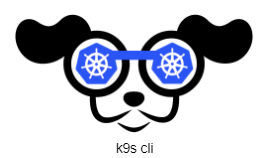
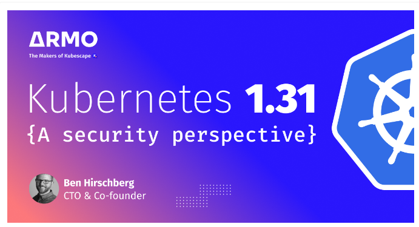
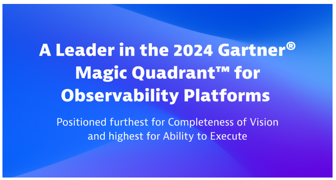
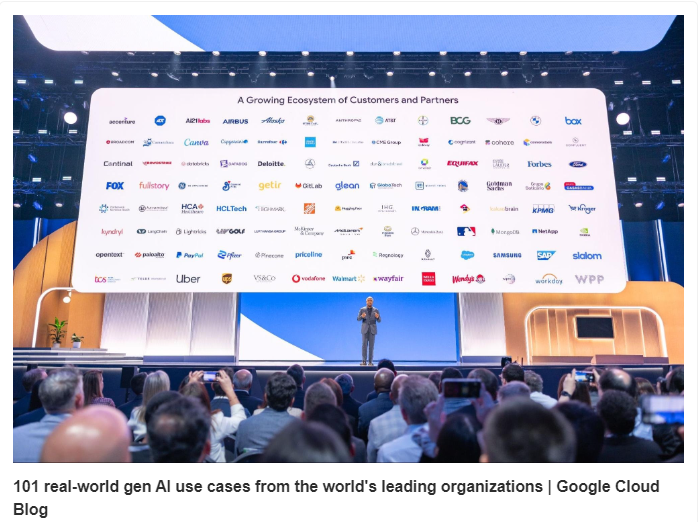
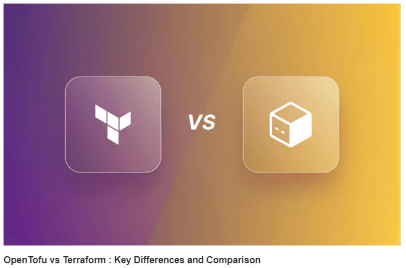
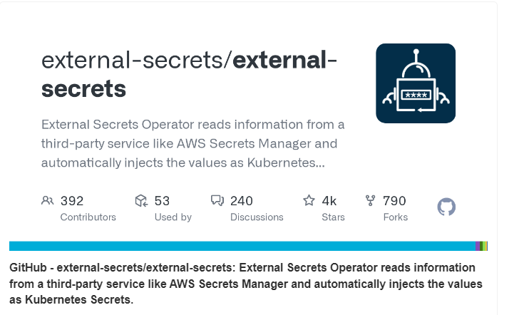

### Multi Cloud GitOps Workflow for Kubernetes Management

Multi Cloud GitOps Workflow for Kubernetes Management

Kubernetes 1.31: Key Security Enhancements You Should Know

Dynatrace named a Leader in the 2024 Gartner® Magic Quadrant™ for Observability Platforms

101 real-world gen AI use cases

OpenTofu vs Terraform : Key Differences and Comparison

Automating Secret Injection from AWS Secrets Manager into Kubernetes

#### Use Case

#### Multi Cloud GitOps Workflow for Kubernetes Management

You may already know about GitOps—a practice that's reshaping how we manage infrastructure and applications by treating Git as the single source of truth.

But what happens when you take GitOps and apply it to multi-cloud implementations?

Well, that’s where things get really interesting. Imagine managing your Kubernetes clusters across AWS, Azure, GCP etc., with the same consistency and ease, regardless of the cloud provider.

This is becoming more than just a trend; it’s a growing necessity for organizations aiming for resilience, flexibility, and control.

Take a look at the illustration below, which provides a snapshot of how GitOps can be extended to manage multi-cloud Kubernetes deployments effectively.

.gif>)

              Multi Cloud GitOps Workflow for Kubernetes Management

##### How it Works (Step-Wise):

Let’s dive into the components that make this architecture work seamlessly:

1. A user begins by creating or updating a Cluster Definition YAML file that outlines the specifications for a Kubernetes cluster.

2. The YAML file is then committed to the Clusters Repo. This action effectively logs the desired state of the cluster in Git, which acts as the source of truth.

3. Argo CD, residing in the Management Cluster, continuously monitors the Clusters Repo for any changes. Once it detects a change, it triggers the necessary actions to ensure the actual state of the clusters reflects the committed YAML file.

4. Rancher UI in the Management Cluster provides a visual interface for managing the clusters. The CAPI Controller automates the creation and lifecycle management of these clusters according to the specifications defined in the YAML file.

5. The Model Repos store core configurations and services needed by all clusters. Argo CD applies these configurations across the relevant clusters, ensuring consistency across your infrastructure.

6. Applications are defined in the Workspace Repo in the form of YAML files. Argo CD ensures these applications are deployed and managed consistently across all Workload Clusters in AWS, Azure, and GCP.

7. Throughout this process, Prometheus and other monitoring tools keep an eye on the health and performance of your clusters.

Argo CD continues to monitor the Git repositories, making sure the actual state always aligns with the desired state.

I understand, this is easier said than done. But I believe this attempt will give an idea of where to start.

### Tool Of The Day

k9scli: A terminal-based UI to manage Kubernetes clusters that integrates SSH-like interactions, allowing you to inspect and manage pods, nodes, and containers.

https://k9scli.io/?utm_source=www.techopsexamples.com&utm_medium=newsletter&utm_campaign=multi-cloud-gitops-workflow-for-kubernetes-management&_bhlid=ecedbafbf6dbcad658ce0ef5f725123819e92534

### Trends & Updates

Kubernetes 1.31: Key Security Enhancements You Should Know

https://www.armosec.io/blog/kubernetes-1-31-security-perspective/?utm_source=www.techopsexamples.com&utm_medium=newsletter&utm_campaign=multi-cloud-gitops-workflow-for-kubernetes-management&_bhlid=fd27196700d42467675d94f69851b1d7a9c76617

2024 Gartner® Magic Quadrant™ for Observability Platforms

https://www.dynatrace.com/gartner-magic-quadrant-for-observability-platforms/?utm_source=www.techopsexamples.com&utm_medium=newsletter&utm_campaign=multi-cloud-gitops-workflow-for-kubernetes-management&_bhlid=299d586bdb79b46a53f030e96ca60b03d621d323

### Resources & Tutorials

https://cloud.google.com/transform/101-real-world-generative-ai-use-cases-from-industry-leaders?utm_source=www.techopsexamples.com&utm_medium=newsletter&utm_campaign=multi-cloud-gitops-workflow-for-kubernetes-management&_bhlid=3b9f13befebd3f48b274d9b041797d947541c255

https://spacelift.io/blog/opentofu-vs-terraform?utm_source=www.techopsexamples.com&utm_medium=newsletter&utm_campaign=multi-cloud-gitops-workflow-for-kubernetes-management&_bhlid=6c0a5ba36c40a806f1e9aa7f1db754d74c070ae1

https://github.com/external-secrets/external-secrets?utm_source=www.techopsexamples.com&utm_medium=newsletter&utm_campaign=multi-cloud-gitops-workflow-for-kubernetes-management&_bhlid=4963922759f0a3afe9251cecb2cc2cba06cd914c

