### Kubernetes RBAC Simplified

Kubernetes RBAC Simplified

Create a powerful Kubernetes security duo with Custom Org Policy and Policy Controller

Monitor your Anthropic applications with Datadog LLM Observability

DevOps Exercises - 2624 exercises and questions

OpenShift vs. Kubernetes: Understanding the differences

DigitalOcean Load Balancer: Scaling to 1,000,000+ Connections

#### Use Case

#### Kubernetes RBAC Simplified

Kubernetes RBAC and security are inseparable, as weak access control can expose your cluster to security threats, making it vulnerable to unauthorized access and potential breaches. It is not a 'good to have' or an afterthought; it is a fundamental necessity.

Some of you may already know this. Let's quickly revise how RBAC works.

Step 1: Define Roles (Role or ClusterRole): What actions are allowed within a namespace (Role) or across the entire cluster (ClusterRole).

Step 2: Creating Service Accounts or Users/Groups: Set up service accounts within Kubernetes or manage external users/groups to take on these roles.

Step 3: Bind Roles to Accounts, Users, or Groups: Use RoleBindings to connect roles to service accounts or users within a namespace, or ClusterRoleBindings for cluster-wide permissions.

Here is the simplified visualization of Kubernetes RBAC:

.gif>)
                 Kubernetes RBAC Sample Visualization

To further understand how RBAC operates, let’s break down the key roles in Kubernetes:

Cluster-admin: Acts as a superuser with full control over all resources across the cluster and namespaces.

Admin: Grants complete read and write access within a specific namespace, including creating roles and bindings but not modifying the namespace itself.

Edit: Allows read and write permissions within a namespace, excluding the ability to view or modify roles or bindings.

View: Provides read-only access within a namespace, without permission to view or change roles or bindings.

As we are talking about the access control, security control is a more aligned context. Let me introduce Oneleet — a trusted partner for real-world security controls and SOC 2 attestation.

Want SOC 2 compliance without the Security Theater?

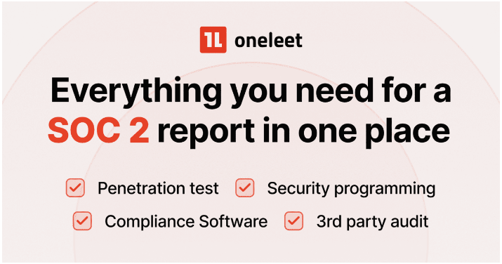

Question 🤔 does your SOC 2 program feel like Security Theater? Just checking pointless boxes, not actually building security?

In an industry filled with security theater vendors, Oneleet is the only security-first compliance platform that provides an “all in one” solution for SOC 2.

We’ll build you a real-world Security Program, perform the Penetration Test, integrate with a 3rd Party Auditor, and provide the Compliance Software … all within one platform.

https://www.oneleet.com/beehiiv?utm_source=beehiiv&utm_medium=beehiiv&utm_campaign=2DZNHNEHF4&_bhiiv=opp_cc9ab030-586d-41c8-9273-113c9ed036d0_ad1ca790&_bhlid=6b8dfb36b2663fa70d2d50a19590e03ec7f711ca

Creating an RBAC role is straightforward, so let’s not go there. Instead, let’s talk about more crucial elements:

#### How to Check Defined Permissions:

Always verify what your service accounts can do—blind spots lead to security breaches.

Use kubectl auth can-i 

These commands check if the app-sa service account in the prod-app namespace can get secrets, list pods, and create deployments.

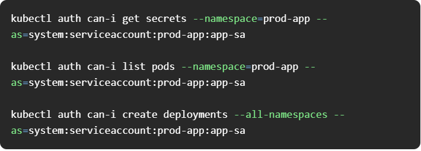

#### Why Default service account shouldn’t be used ?

Default service accounts often have broad permissions that can be a security risk. Create and use custom service accounts to better control and limit access.

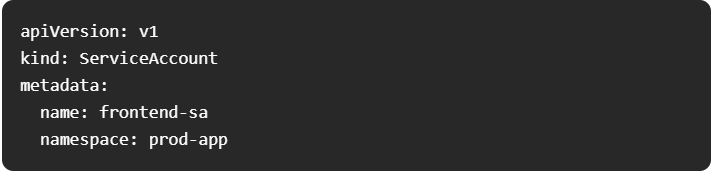

Assign this service account to your frontend application pod:

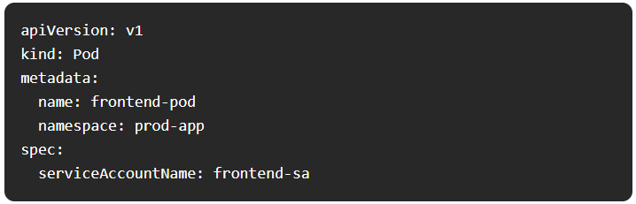

#### Disabling auto mounting of service account token

Only mount tokens when absolutely necessary for the pod's operation. This way you reduce the significant risk of token exposures.

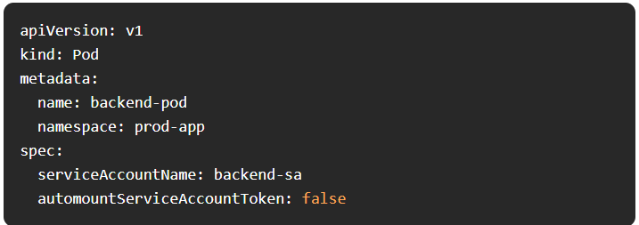

#### Implementing Least Privilege access

Assign only the permissions that are absolutely necessary for a role to perform its tasks. This minimizes potential damage if a service account is compromised.

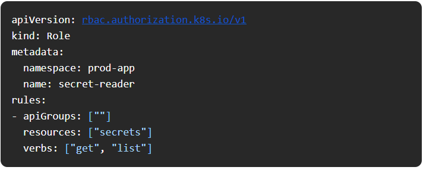

#### Define roles for different permissions, not for different service accounts

This way, you avoid role duplication and can easily update permissions in one place without worrying about multiple service accounts having differing access levels.

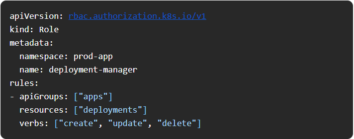

Security is everyone’s responsibility. RBAC just sets the boundaries.  

#### Tool Of The Day

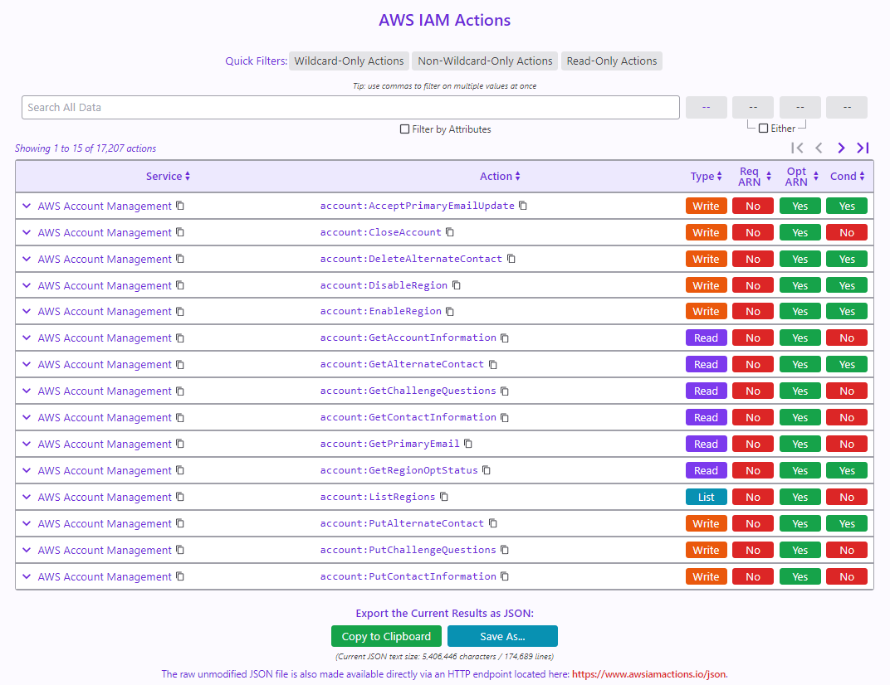

Lets you search AWS IAM actions and export the results as JSON. It's a simple interface that makes finding the right permissions much easier than digging through AWS docs.

https://www.awsiamactions.io/

#### Trends & Updates

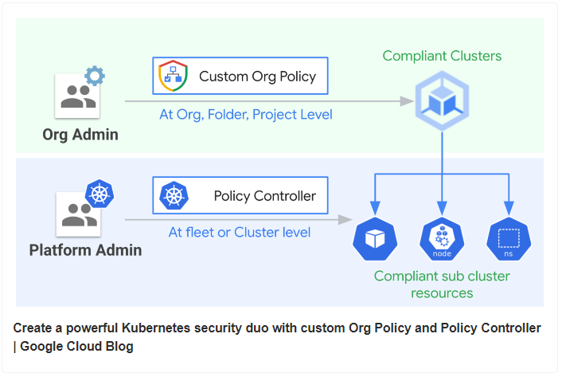

https://cloud.google.com/blog/products/identity-security/create-a-powerful-kubernetes-security-duo-with-custom-org-policy-and-policy-controller/?utm_source=www.techopsexamples.com&utm_medium=newsletter&utm_campaign=kubernetes-rbac-simplified&_bhlid=46ecceb1974a8ff3544f6b7882e52b47270a882c

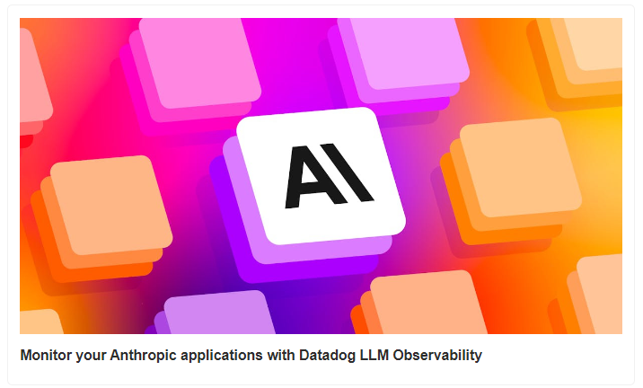

https://www.datadoghq.com/blog/anthropic-integration-datadog-llm-observability/?utm_source=www.techopsexamples.com&utm_medium=newsletter&utm_campaign=kubernetes-rbac-simplified&_bhlid=2b5a85f90246d2e93c726885d473b862dc5bd055

#### Resources & Tutorials

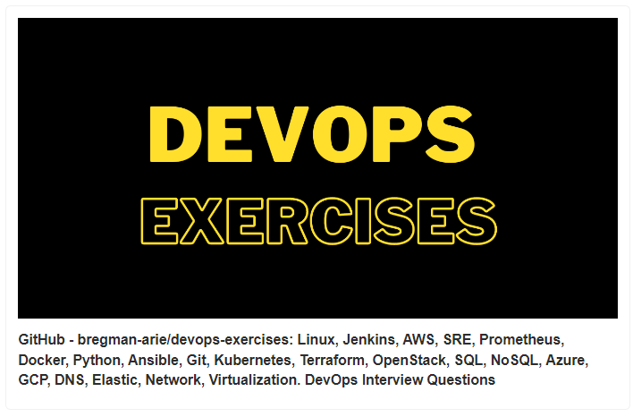

https://github.com/bregman-arie/devops-exercises?utm_source=www.techopsexamples.com&utm_medium=newsletter&utm_campaign=kubernetes-rbac-simplified&_bhlid=ead27f8be1c5cadc95831495f318a6d2dd9af3da

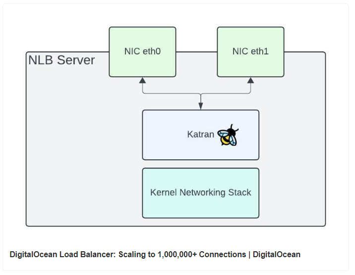

https://www.digitalocean.com/blog/load-balancer-scaling-to-1000000-connections?utm_source=www.techopsexamples.com&utm_medium=newsletter&utm_campaign=kubernetes-rbac-simplified&_bhlid=7ef0ce1261987c470a19348e9b4fe611d20c9fca

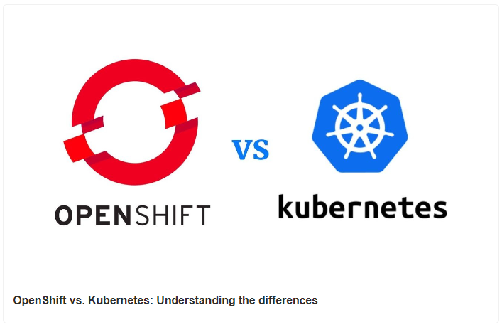

https://www.dynatrace.com/news/blog/openshift-vs-kubernetes/?utm_source=www.techopsexamples.com&utm_medium=newsletter&utm_campaign=kubernetes-rbac-simplified&_bhlid=93425de99c73cbc0e2c75365d468c5b7a4250a28

