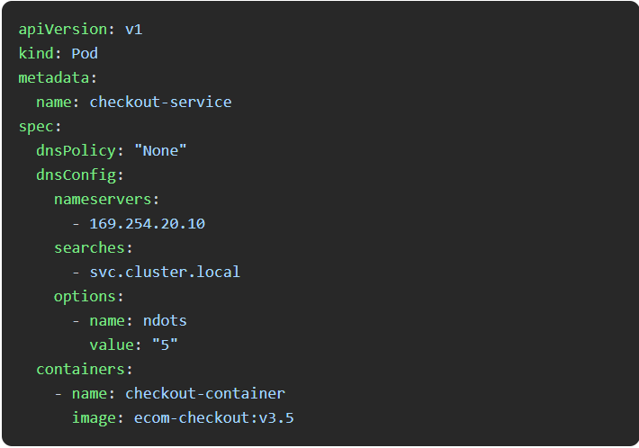
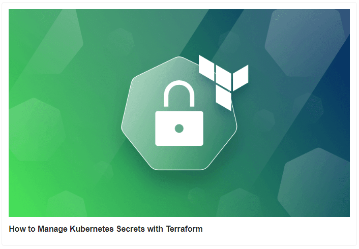

## Kubernetes DNS Optimization

Kubernetes DNS Optimization

How AWS powered Prime Day 2024 for record-breaking sales

Announcing Linkerd 2.16

Kubernetes on VMs vs. Bare Metal: Comparison of Performance

5 Tips To Help You Save On DynamoDB Costs

How to Manage Kubernetes Secrets with Terraform

### Use Case

### Kubernetes DNS Optimization

It's easy to fall into the trap of default configurations. The out-of-the-box setup often works, but at what cost?

Let's dive into a scenario that might look familiar, and then explore how a few tweaks can lead to a faster, more consistent experience.

.jpg>)

Imagine you’re running an e-commerce platform. Your checkout service is critical, but you've stuck with a basic Kubernetes Pod configuration:

### Issues with this setup:

  By default, Kubernetes relies on the cluster's DNS service to resolve service names. The DNS resolver might struggle to keep up with frequent lookups.

  The default DNS policy (ClusterFirst) sends queries to the cluster DNS service, even for external names. This can lead to unnecessary traffic and delays in DNS resolution.

  Under certain conditions, such as DNS cache exhaustion or network congestion, potential DNS resolution failures causes delays or even downtime for your checkout service.

Now, consider making a few adjustments to your Kubernetes Pod configuration to optimize DNS resolution:

#### Technical Improvements:

  Custom DNS Policy: By setting dnsPolicy: "None", you bypass the default cluster DNS and explicitly define how DNS resolution should occur.

  Optimized DNS Configurations: With dnsConfig, you specify a dedicated nameserver (169.254.20.10 in this case) that’s tailored for your environment, ensuring faster and more reliable lookups.

    Search Domain Optimization: By setting searches to svc.cluster.local, you streamline the domain search process, making it faster for Kubernetes to resolve service names within the cluster.

    Reduced Lookup Depth: The ndots: "5" option configures the resolver to treat names with more than 5 dots as fully qualified domain names (FQDNs), reducing the time spent on unnecessary search path expansions and speeding up DNS resolution.

#### Why This Matters

By customizing your DNS configurations, you can reduce latency, avoid unnecessary lookups, and ultimately deliver a faster, more consistent service.

"Default isn't always bad, but optimizing beyond the default can turn good enough into great."

### Tool Of The Day

https://ots.sniptt.com/?utm_source=www.techopsexamples.com&utm_medium=newsletter&utm_campaign=kubernetes-dns-optimization&_bhlid=3b797012184fe3e6875b284c78804a0a91ba3c52

### Trends & Updates

https://aws.amazon.com/blogs/aws/how-aws-powered-prime-day-2024-for-record-breaking-sales/?utm_source=www.techopsexamples.com&utm_medium=newsletter&utm_campaign=kubernetes-dns-optimization&_bhlid=74a308bb34418d4cbd5bdffb1613ad5eff5e9e82

https://linkerd.io/2024/08/13/announcing-linkerd-2.16/?utm_source=www.techopsexamples.com&utm_medium=newsletter&utm_campaign=kubernetes-dns-optimization&_bhlid=ca924914aa842a3a0dd6595fbd2eb82c755ffaab

### Resources & Tutorials

https://makeitsimple.medium.com/kubernetes-on-vms-vs-bare-metal-comparison-of-performance-674a920b93e4

https://differ.blog/webdev/5-tips-to-help-you-save-on-dynamodb-costs-dc020f?utm_source=www.techopsexamples.com&utm_medium=newsletter&utm_campaign=kubernetes-dns-optimization&_bhlid=13580b1e962f2019f83aa41c7a852685509d0a38

https://spacelift.io/blog/terraform-kubernetes-secret?utm_source=www.techopsexamples.com&utm_medium=newsletter&utm_campaign=kubernetes-dns-optimization&_bhlid=e9f7ab15a66134d3b94cdf1500504d8a7dad44a5

