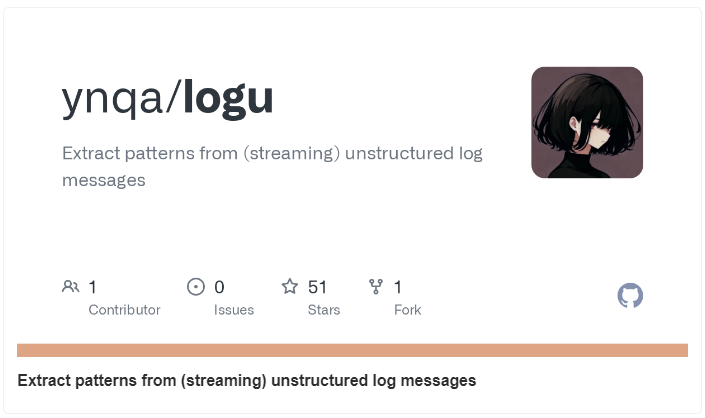
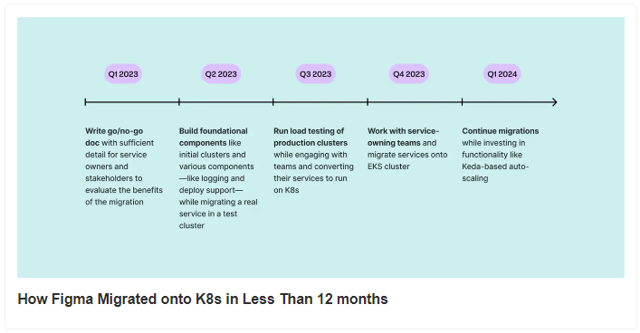
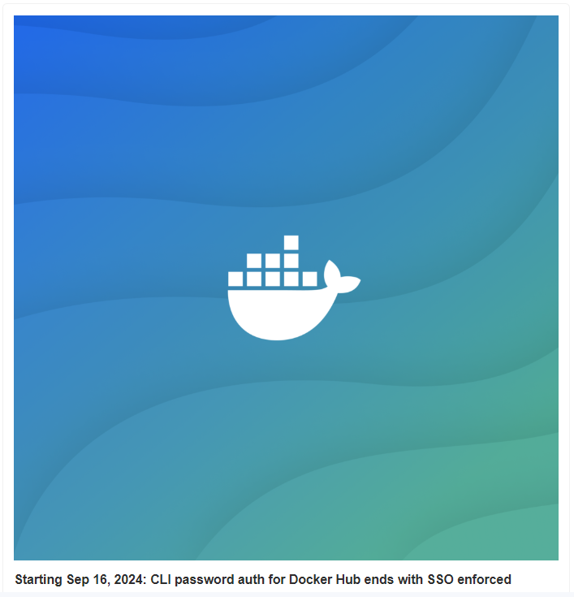
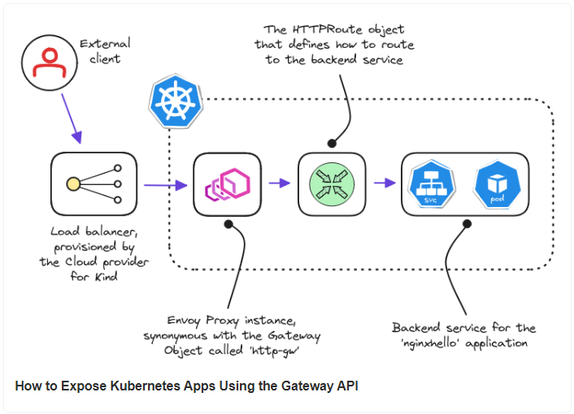
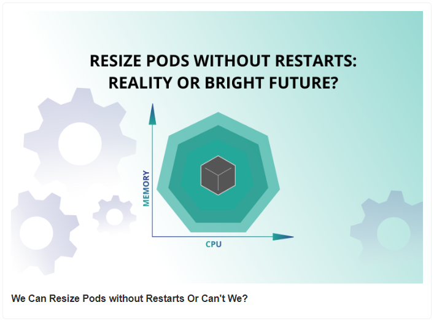
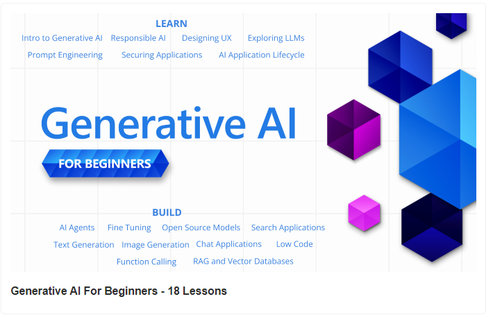

# Multi Cloud Secrets Rotation Explained

- Multi Cloud Secrets Rotation Explained

- How Figma Migrated onto K8s in Less Than 12 months

- Starting Sep 16, 2024: CLI password auth for Docker Hub ends with SSO enforced

- How to Expose Kubernetes Apps Using the Gateway API

- We Can Resize Pods without Restarts Or Can't We?

- Generative AI For Beginners - 18 Lessons

### Use Case

### Multi Cloud Secrets Rotation Explained

Each cloud providers—like AWS, Azure, and Google Cloud—has its own way of handling secrets.

This illustration will help simplify the understanding of how these workflows operate across different clouds.

.gif>)

### AWS:

- A rotation event triggers AWS Secrets Manager to start the secret rotation process.

- Secrets Manager creates a new version of the secret and initiates a multi-step rotation.

- It calls a custom Lambda function that updates all dependent resources, such as Kubernetes clusters or APIs, with the new secret.

- The new secret version is then activated and stored in Secrets Manager, ensuring all resources use this updated secret.

### Azure:

- A rotation event occurs, triggered by Azure Key Vault detecting a secret nearing its expiry.

- This event is passed to Azure Event Grid, which routes it to an Azure Function App.

- The Function App regenerates the secret and updates it in Key Vault.

- If needed, the new secret is stored in a Storage Account for auditing or further processing.

- The updated secret is then distributed to all dependent resources, such as SQL databases, Kubernetes clusters, or APIs, and becomes the active secret.

### GCP:

- The process starts with a rotation event, triggered by Cloud Scheduler or Pub/Sub.

- A Google Cloud Function, designed for secret rotation, handles the process.

- The function generates a new secret, updates it in Secret Manager, and associates it with the relevant service accounts and IAM roles.

- The new active secret is then distributed to all dependent resources, ensuring that Kubernetes clusters, APIs, and other services are updated to use it.

Not keeping up with these rotation steps can make your systems unsafe, so always make sure your secrets are updated and secure.

## Tool Of The Day

https://github.com/ynqa/logu?utm_source=www.techopsexamples.com&utm_medium=newsletter&utm_campaign=multi-cloud-secrets-rotation-explained&_bhlid=bdce365712a0b7055a8a9413ed2ea1505f94aeaa

## Trends & Updates

https://www.figma.com/blog/migrating-onto-kubernetes/?utm_source=www.techopsexamples.com&utm_medium=newsletter&utm_campaign=multi-cloud-secrets-rotation-explained&_bhlid=f5647cf77cb40778455b8607ac56275342a87ace

https://www.docker.com/blog/deprecation-of-password-logins-on-cli-with-docker-sso-enforcement/?utm_source=www.techopsexamples.com&utm_medium=newsletter&utm_campaign=multi-cloud-secrets-rotation-explained&_bhlid=a673bdedf7f7acf7e2a73d694d206e2759e89be1

## Resources & Tutorials

https://semaphoreci.com/blog/kubernetes-gateway-api?utm_source=www.techopsexamples.com&utm_medium=newsletter&utm_campaign=multi-cloud-secrets-rotation-explained&_bhlid=329b7988e31e087a08c6097deec4ce01e4bd9c9f

https://www.perfectscale.io/blog/resize-pods-without-restarts?utm_source=www.techopsexamples.com&utm_medium=newsletter&utm_campaign=multi-cloud-secrets-rotation-explained&_bhlid=bd22836c2a3076157efc154a3633fe48222923d1

https://microsoft.github.io/generative-ai-for-beginners/?utm_source=www.techopsexamples.com&utm_medium=newsletter&utm_campaign=multi-cloud-secrets-rotation-explained&_bhlid=e96f7c2faba5546bc3202ce43b32c605d62b591b#/

## Picture Of The Day

### AWS classic console:

.jpg>)
