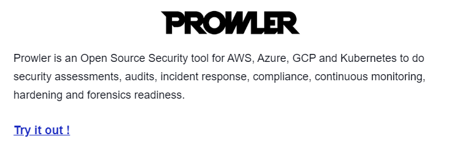
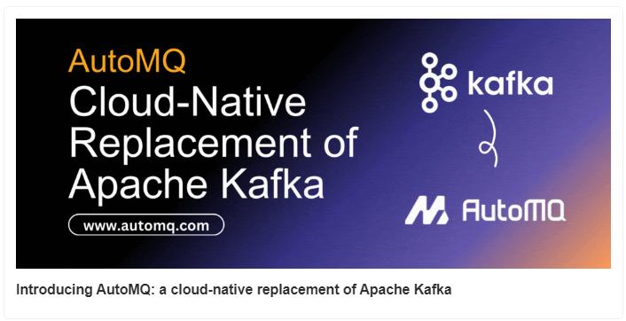
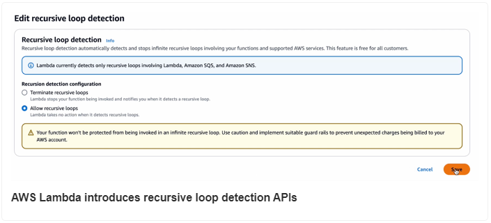
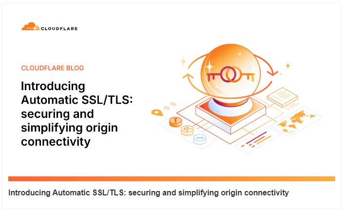
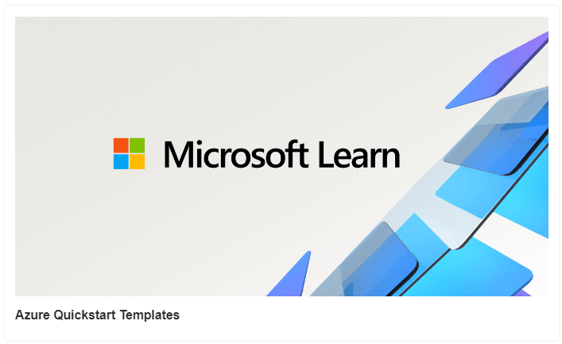
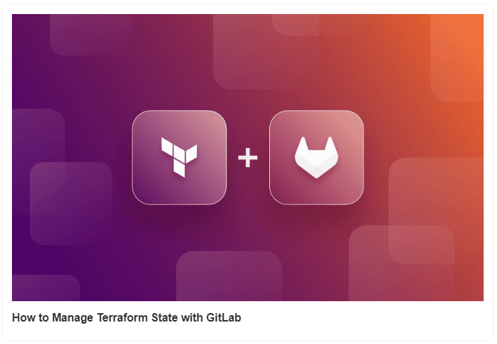

# MLOps Work Load Orchestration (AWS Recommended)

- MLOps Work Load Orchestration (AWS Recommended)

- Introducing AutoMQ: a cloud-native replacement of Apache Kafka

- AWS Lambda introduces recursive loop detection APIs

- Introducing Automatic SSL/TLS: securing and simplifying origin connectivity

- How to Manage Terraform State with GitLab [Tutorial]

- Azure Quickstart Templates

## Use Case

### MLOps Work Load Orchestration (AWS Recommended)

MLOps is the most happening topic in AI, seamlessly merging data science with IT operations to streamline and scale machine learning in production.

This illustration will help simplify the understanding of MLOps workload orchestration on AWS.

.gif>)

The MLOps load orchestration can be broken down into the following steps:

1. The Orchestrator (solution owner or DevOps engineer) starts the solution in the AWS account, selecting options like Amazon SageMaker model registry or an existing S3 bucket.

2. The Orchestrator uploads necessary assets (model artifacts, training data, etc.) to the S3 bucket. If using SageMaker model          registry, they register the model.

3. The solution creates an AWS CodePipeline by either triggering an API call to API Gateway or pushing the mlops-config.json to Git. The AWS Lambda function packages the CloudFormation template using the provided configurations.

4. The DeployPipeline stage uses the packaged CloudFormation template to deploy the pipeline in the account.

5. Once deployed, users access the pipeline's features, and an Amazon SNS notification is sent to the specified email.

Remember, successful MLOps requires careful orchestration—overlooking would lead to missteps, mishaps, and missed opportunities.

## Tool Of The Day

https://github.com/prowler-cloud/prowler?utm_source=www.techopsexamples.com&utm_medium=newsletter&utm_campaign=mlops-work-load-orchestration-aws-recommended&_bhlid=71370b34ab94022f4601606f9976a2135d4520ab

## Trends & Updates

https://dev.to/automq/introducing-automq-a-cloud-native-replacement-of-apache-kafka-kkc?utm_source=www.techopsexamples.com&utm_medium=newsletter&utm_campaign=mlops-work-load-orchestration-aws-recommended&_bhlid=c0821d99afa01587a326857bf4e5aae93bd060fa

https://aws.amazon.com/blogs/compute/aws-lambda-introduces-recursive-loop-detection-apis/?utm_source=www.techopsexamples.com&utm_medium=newsletter&utm_campaign=mlops-work-load-orchestration-aws-recommended&_bhlid=827d81345b1dca1cf4a9772a991783803e138eb2

## Resources & Tutorials

https://blog.cloudflare.com/introducing-automatic-ssl-tls-securing-and-simplifying-origin-connectivity?utm_source=www.techopsexamples.com&utm_medium=newsletter&utm_campaign=mlops-work-load-orchestration-aws-recommended&_bhlid=b656b734fdaef2429586e463fa2dd610e62d5b1d

https://learn.microsoft.com/en-us/samples/browse/?expanded=azure&products=azure-resource-manager&utm_source=www.techopsexamples.com&utm_medium=newsletter&utm_campaign=mlops-work-load-orchestration-aws-recommended&_bhlid=aaa8053c85e7338dfbc42e479e021ab99c01f7e1

https://spacelift.io/blog/gitlab-terraform-state?utm_source=www.techopsexamples.com&utm_medium=newsletter&utm_campaign=mlops-work-load-orchestration-aws-recommended&_bhlid=1d168cd7d612bcd1f66ad5ea0d1442d8c7a8aa06

## Picture Of The Day

07 Apr 2005: Very first commit Linus Torvalds made on git.

.png>)

