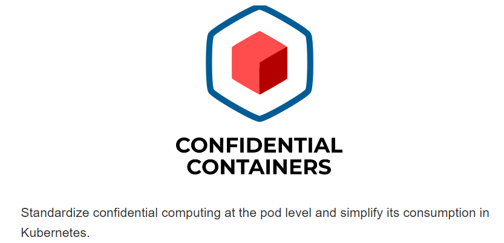

# GitHub Actions Workflow for Terraform workspaces

- GitHub Actions Workflow for Terraform workspaces

- MFA for Azure will soon be mandatory

- Istio has deprecated its In-Cluster Operator

- FinOps Foundations: Strategies for Cross-Team Alignment

- Bucket Monopoly: Breaching AWS Accounts Through Shadow Resources

- DevOps Roadmap for 2024 with learning resources

## Use Case

### GitHub Actions Workflow for Terraform workspaces

Terraform workspaces are essential for managing different environments within the same configuration, such as development, staging, and production. Without them, keeping track of changes and maintaining consistency across environments would be chaotic, if not impossible.

Some of you might already be familiar with this. Let’s quickly go over how workspaces actually work.

#### How Workspaces Work in Terraform:

- Each environment is assigned a unique state file to keep configurations isolated.

- Switch between environments by selecting the corresponding state file.

- Commands like terraform workspace new and terraform workspace select are used to create and switch between environments.

- The active environment determines which state file Terraform uses during operations.

- State files are stored in a backend, and each environment's state is kept separate.

Popularly used backends - S3, GCS, or Blob Storage.

Products like Scalr and Terraform Cloud provide an inbuilt option to maintain the workspaces and respective state files.

This diagram will help simplify how Terraform workspaces integrate with GitHub Actions to manage environments.

.gif>)

Step 1: Infra team writes Terraform configuration files ( main.tf,  providers.tf, etc.) to define infrastructure.

Step 2: Code is pushed to GitHub, triggering an automated workflow using GitHub Actions.

Step 3: GitHub Actions execute Terraform to validate the workspace-specific state files from the backend.

Step 4: Terraform ensures consistency across workspaces and performs provisioning based on the validated state files.

Step 5: Resources are provisioned across cloud environments like AWS, Azure, or Google Cloud based on the validated configurations.

#### Sample GitHub Actions yaml:

#### Explanation:

- on: push: The workflow is triggered on pushes to the main branch and any branch that follows the pattern workspace/*, representing different Terraform workspaces.

- terraform init: Initializes Terraform and configures the backend using the backend.tfvars file.

- workspace select/new: Selects the appropriate workspace based on the branch name or creates it if it doesn’t exist.

- terraform validate: Validates the Terraform configuration files.

- terraform plan: Creates a plan to show what changes Terraform will make.

- terraform apply: Applies the plan if the push is to the main branch, ensuring that only validated code in the main branch impacts the actual infrastructure.

- This file can be customized further based on your specific requirements and environment configurations.

## Tool Of The Day

https://confidentialcontainers.org/?utm_source=www.techopsexamples.com&utm_medium=newsletter&utm_campaign=github-actions-workflow-for-terraform-workspaces&_bhlid=0d5ce83165f5667800cb3525e52e7d7bf38920f4

## Trends & Updates

https://azure.microsoft.com/en-us/blog/announcing-mandatory-multi-factor-authentication-for-azure-sign-in/?utm_source=www.techopsexamples.com&utm_medium=newsletter&utm_campaign=github-actions-workflow-for-terraform-workspaces&_bhlid=b743df4c970280ab31426d23dd9fd9635f874b9b

https://istio.io/latest/blog/2024/in-cluster-operator-deprecation-announcement/?utm_source=www.techopsexamples.com&utm_medium=newsletter&utm_campaign=github-actions-workflow-for-terraform-workspaces&_bhlid=2e0834a1dc4cc8235f08ca56ac35dbfe84ab32f9

## Resources & Tutorials

https://blog.kubecost.com/blog/finops-team-alignment/?utm_source=www.techopsexamples.com&utm_medium=newsletter&utm_campaign=github-actions-workflow-for-terraform-workspaces&_bhlid=42ae483b251abe15540f8f84b1ff875ab76e46f3

https://www.aquasec.com/blog/bucket-monopoly-breaching-aws-accounts-through-shadow-resources/?utm_source=www.techopsexamples.com&utm_medium=newsletter&utm_campaign=github-actions-workflow-for-terraform-workspaces&_bhlid=7dbc3c90a14de5e66ae8e6b548c744258ef106df

https://github.com/milanm/DevOps-Roadmap?utm_source=www.techopsexamples.com&utm_medium=newsletter&utm_campaign=github-actions-workflow-for-terraform-workspaces&_bhlid=e654132266219dfd18213b57836d1a77731e1cf4

## Picture Of The Day

Nat Friedman, Satya Nadella, and Chris Wanstrath posing with the Octocat, marking the moment GitHub officially joined Microsoft in a $7.5 billion acquisition.

Was Microsoft's $7.5 billion GitHub acquisition worth it?
💰 Money well spent!
🤔 Ask me in 5 years
😬 They could've just forked it !

