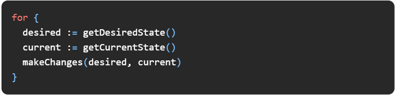
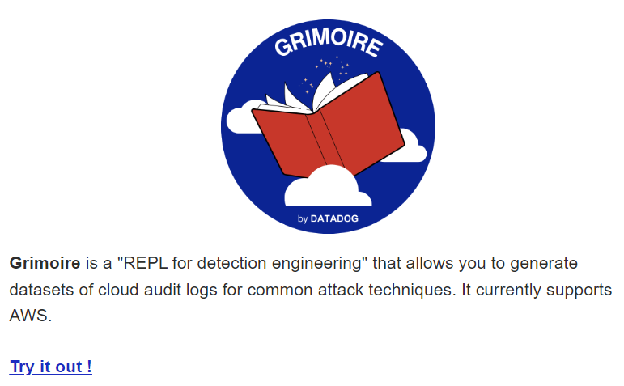
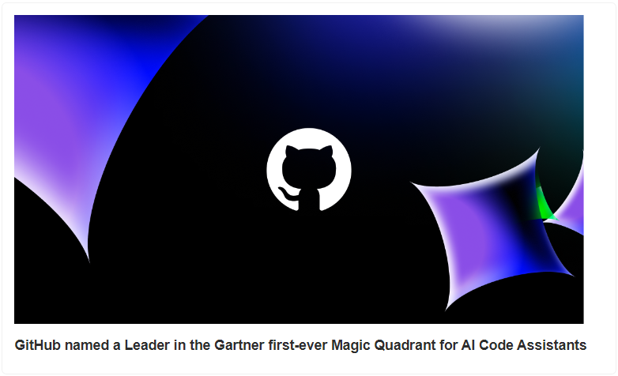
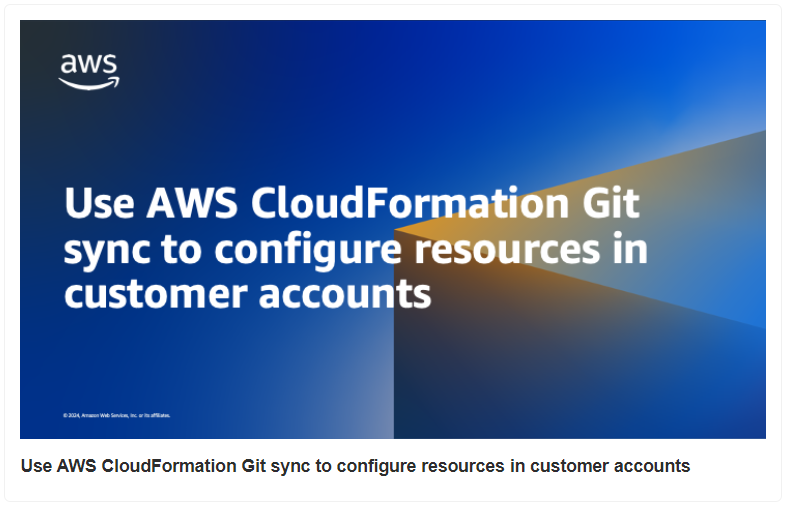
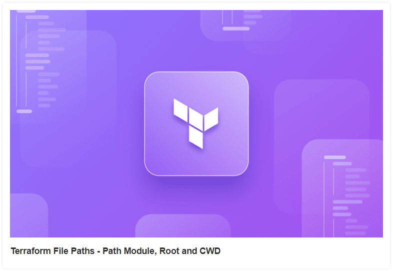
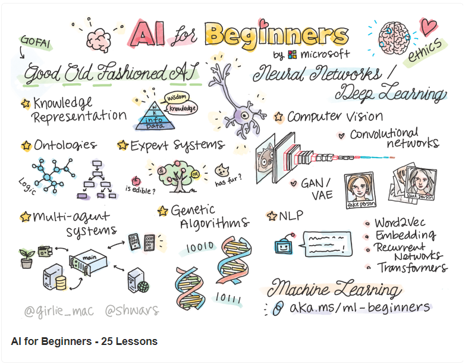
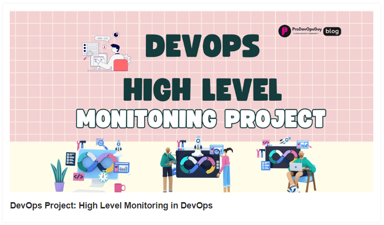

# Why You Need a Kubernetes Controller

- Why You Need a Kubernetes Controller

- GitHub named a Leader in the Gartner first-ever Magic Quadrant for AI Code Assistants

- Use AWS CloudFormation Git sync to configure resources in customer accounts

- Terraform File Paths – Path Module, Root and CWD

- AI for Beginners - 25 Lessons

- DevOps High Level Monitoring Project

## Use Case 

### Why You Need a Kubernetes Controller

To begin with - A Kubernetes controller is a control loop that watches the state of your cluster, makes decisions, and takes actions to adjust the current state to match the desired state.  

.jpg>)

### Desired State Vs Current State:

Almost every Kubernetes object has two key parts that define its configuration: the spec and the status.

The spec outlines what you want the resource to be, detailing the desired characteristics and behaviors.

The status reflects the current conditions of the resource, updated by Kubernetes as the system runs.

Kubernetes Controllers constantly work to align the actual conditions of each resource with the desired configuration you set.

Control loop implementation snippet:

###### Kubernetes Controller Breakdown:

.gif>)

Kubernetes Controller Architecture

- User submits a YAML or JSON manifest defining the desired state of resources (e.g., deployments, services).

- Kubernetes controller retrieves the manifest and compares it to the current state of the cluster.

- The controller leverages the shared informer to efficiently cache and track resource updates from the API server, reducing API calls.

- Shared informer syncs with the API server using watches to obtain the current state of resources (e.g., pods, nodes).

- The controller enqueues reconciliation tasks in the work queue if discrepancies between the desired and actual states are detected.

- The work queue processes these tasks, triggering the controller to generate and send appropriate API requests to the API server.

- API server validates and processes these requests, sending commands to the kubelet on worker nodes.

- Kubelet on each worker node executes the commands, pulling container images, starting pods, or terminating resources to align the cluster with the desired state.

### Types Of Controllers:

There are various types of Kubernetes controllers; here are a few popular ones to manage your cluster effectively.

.jpg>)

##### Why do you need a Kubernetes Controller ?

###### Without controllers:

- Node failures wouldn't be detected when they occur, leading to outages and performance issues.

- Persistent volumes wouldn't be provisioned or managed when needed, risking data loss and unavailability.

- DNS records for services and pods wouldn't update when changes happen, causing service discovery failures.

- Auto-scaling based on resource usage wouldn't occur when demand spikes, leading to inefficient resource utilization.

- Resource quotas across namespaces wouldn't be enforced when resources are over-consumed, risking exhaustion and instability.

And much more…

The USP of controllers lies in preventing configuration drift and automatically handling failures, keeping your Kubernetes environment consistent and resilient.

## Tool Of The Day

https://github.com/dataDog/grimoire?utm_source=www.techopsexamples.com&utm_medium=newsletter&utm_campaign=why-you-need-a-kubernetes-controller&_bhlid=a90ba9b10ea1b983c4a853eb6f6970c28635120e

## Trends & Updates

https://github.blog/news-insights/company-news/github-named-a-leader-in-the-gartner-first-ever-magic-quadrant-for-ai-code-assistants/?utm_source=www.techopsexamples.com&utm_medium=newsletter&utm_campaign=why-you-need-a-kubernetes-controller&_bhlid=c7be32d677acf86ee1d977557061b2b519742ade

https://aws.amazon.com/blogs/devops/use-aws-cloudformation-git-sync-to-configure-resources-in-customer-accounts/?utm_source=www.techopsexamples.com&utm_medium=newsletter&utm_campaign=why-you-need-a-kubernetes-controller&_bhlid=470fb8a9c846c99a700bb437094093a75aae1ac3

## Resources & Tutorials

https://spacelift.io/blog/terraform-path?utm_source=www.techopsexamples.com&utm_medium=newsletter&utm_campaign=why-you-need-a-kubernetes-controller&_bhlid=011676c1778b2bc8e506bf4752f0544fb4a65940

    

https://microsoft.github.io/AI-For-Beginners/?utm_source=www.techopsexamples.com&utm_medium=newsletter&utm_campaign=why-you-need-a-kubernetes-controller&_bhlid=83114569e58095da18a0e29cfbffa850f80d9224

https://dev.to/prodevopsguytech/devops-project-high-level-monitoring-in-devops-png?utm_source=www.techopsexamples.com&utm_medium=newsletter&utm_campaign=why-you-need-a-kubernetes-controller&_bhlid=2d3af90caa3b0121bc04245cc77ddc95b3c078b0

## Picture Of The Day

.jpg>)

