# How to Reduce Docker Image Size

- How to Reduce Docker Image Size

- GitHub Enterprise Server vulnerable to critical auth bypass flaw

- Kubernetes 1.31 Brings More Stability to Cloud-Native Deployments

- Docker Best Practices: Choosing Between RUN, CMD, and ENTRYPOINT

- EKS Secret Management - with Golang, AWS ParameterStore and Terraform

-  curated list for awesome Kubernetes sources

## Use Case

### How to Reduce Docker Image Size

Minimizing Docker image sizes accelerates container deployment, and for large-scale operations, this can lead to substantial savings in storage space.

### 1. Use Official Minimal Base Images:

When building Docker images, always start with an official base image. Instead of using a full-sized OS image, opt for lightweight versions like python:3.9-slim or python:3.9-alpine. These minimal images contain only the essentials, significantly reducing the image size.

###### Taking an example for a Python image, here are the image sizes for 
python:3.9 vs python:3.9-alpine:

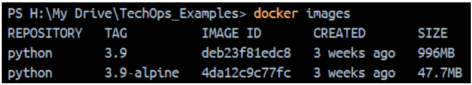

Python 3.9-alpine is a whomping 95.2% smaller than Python 3.9.

### 2. Minimize Layers:

Every command in your Dockerfile (like RUN, COPY, etc.) generates a separate layer in the final image. Grouping similar commands together into one step decreases the total number of layers, leading to a smaller overall image size.

###### Instead of doing this:

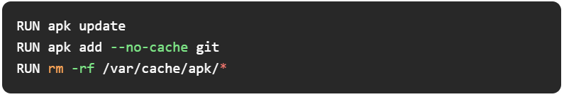

###### Do this:

### 3. Use .dockerignore File:

When creating Docker images, Docker transfers all the files from your project directory into the image by default. To avoid including unneeded files, use a .dockerignore file to exclude them.

###### Sample .dockerignore

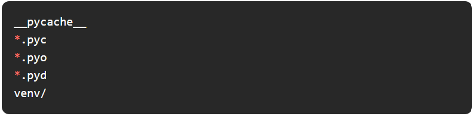

### 4. Multi-Stage Builds (Mandatory atleast for me 😀):

Multi-stage builds enable you to divide the build process from the final runtime environment. This approach is particularly beneficial when your application needs certain tools for compiling that are not necessary in the final image.

###### Single Stage Vs Multi-Stage Builds Comparison:

Take an example of a Flask app built using the python:3.9-alpine image with a single-stage Dockerfile like:

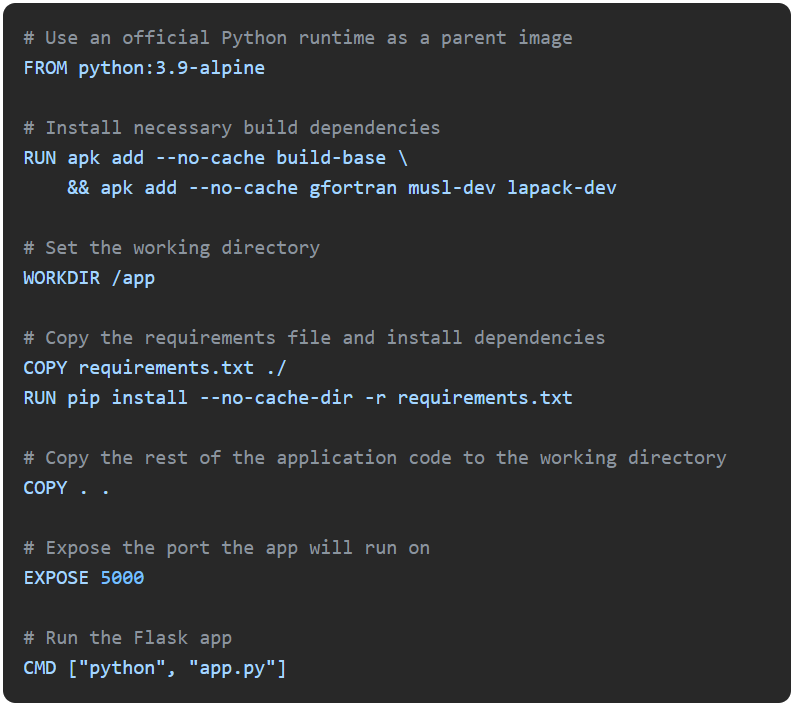

.png>)

Docker - Single Stage Build Output

The image built was of size: 588 MB

###### Redesigned Multi Stage Dockerfile looks like:

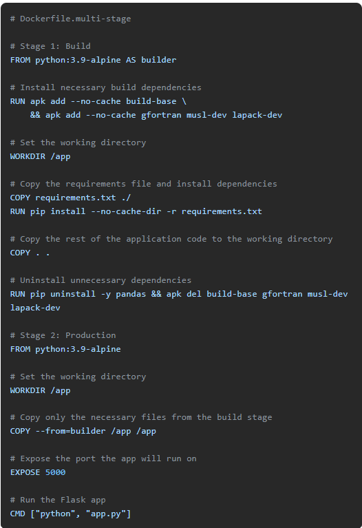

.png>)

Docker - Multi Stage Build Output

The new image size was: Only 47.7 MB

The application works exactly the same, but it spins up much faster in this version.

###### This is an illustration of the drastic effect of Multi-Stage Builds.

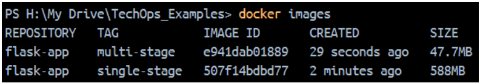

.png>)

### 5. Use Static Binaries and the 'scratch' Base Image:

If your application can be compiled into a static binary, you can use the scratch base image, which is essentially an empty image. This leads to extremely small final images.

Example:

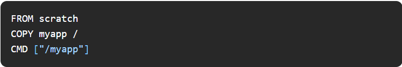

Works well for applications that don’t need operating system-level dependencies.

###### Security Considerations

- Use Trusted and Official Base Images

- Run Containers as Non-Root Users

- Regularly scan your Docker images for known vulnerabilities

- Limit the network exposure of your container by restricting the ports and IP addresses

Avoid hardcoding sensitive information like API keys or passwords directly into your Dockerfile or environment variables.

Final reminder,

Less the image size = Faster deployments + Quicker scaling + Lean infrastructure

## Tool Of The Day

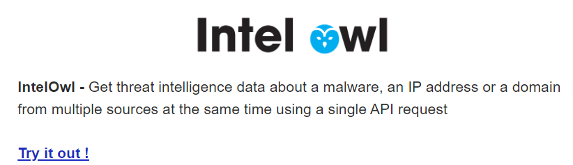

https://github.com/intelowlproject/IntelOwl?utm_source=www.techopsexamples.com&utm_medium=newsletter&utm_campaign=how-to-reduce-docker-image-size&_bhlid=937aa84093b940fe0a251518742de234e7c9c87a

## Trends & Updates

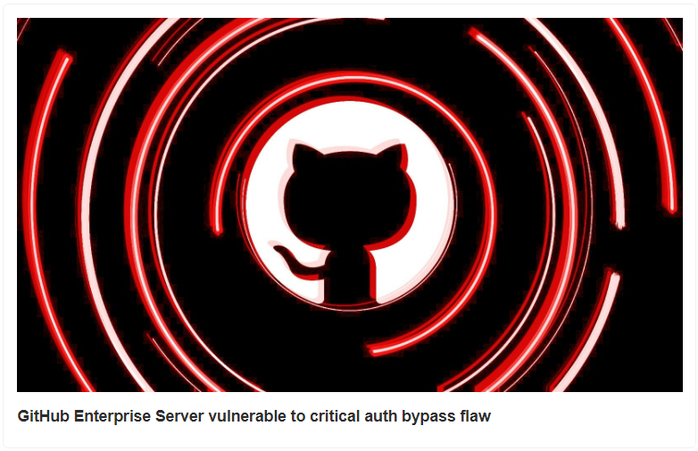

https://www.bleepingcomputer.com/news/security/github-enterprise-server-vulnerable-to-critical-auth-bypass-flaw/?utm_source=www.techopsexamples.com&utm_medium=newsletter&utm_campaign=how-to-reduce-docker-image-size&_bhlid=43be2f2968b5e6d7e7fc60ee90bb442f85f02a5e

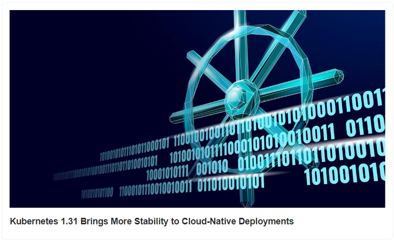

https://www.itprotoday.com/hybrid-cloud/kubernetes-1-31-brings-more-stability-to-cloud-native-deployments?utm_source=www.techopsexamples.com&utm_medium=newsletter&utm_campaign=how-to-reduce-docker-image-size&_bhlid=31655091eca4863f9d781168bd3191952a85da31

## Resources & Tutorials

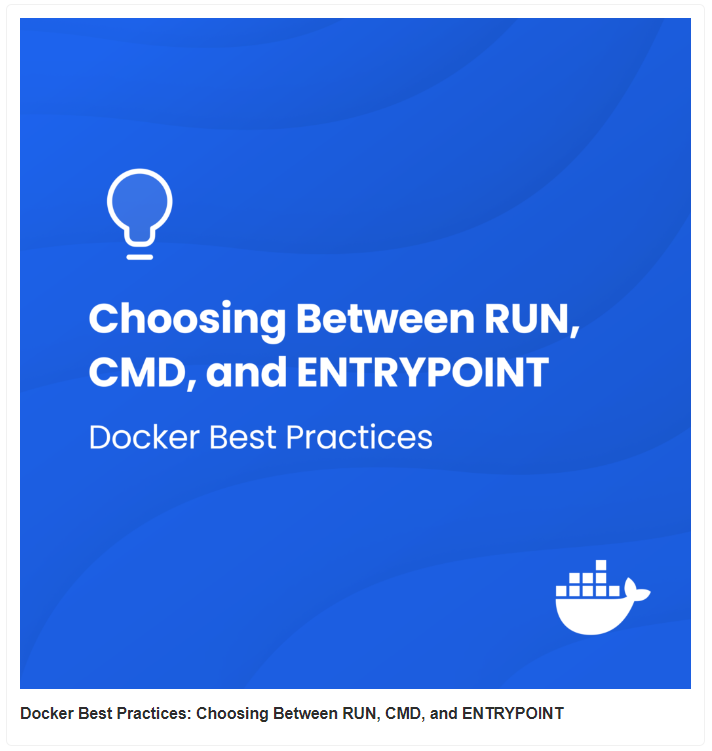

https://www.docker.com/blog/docker-best-practices-choosing-between-run-cmd-and-entrypoint/?utm_source=www.techopsexamples.com&utm_medium=newsletter&utm_campaign=how-to-reduce-docker-image-size&_bhlid=a7ab34a0b75505c04b6c55387ea6f6bc7290b474

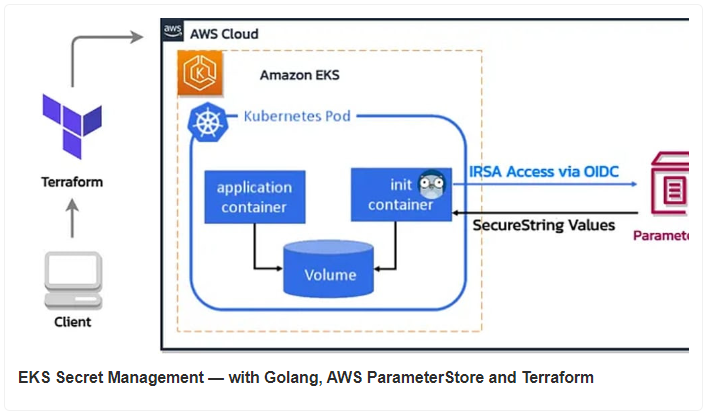

https://dev.to/wardove/eks-secret-management-with-golang-aws-parameterstore-and-terraform-4h24?utm_source=www.techopsexamples.com&utm_medium=newsletter&utm_campaign=how-to-reduce-docker-image-size&_bhlid=f27a99f77584a7f0054aa4aa927ce0e645cb42b6

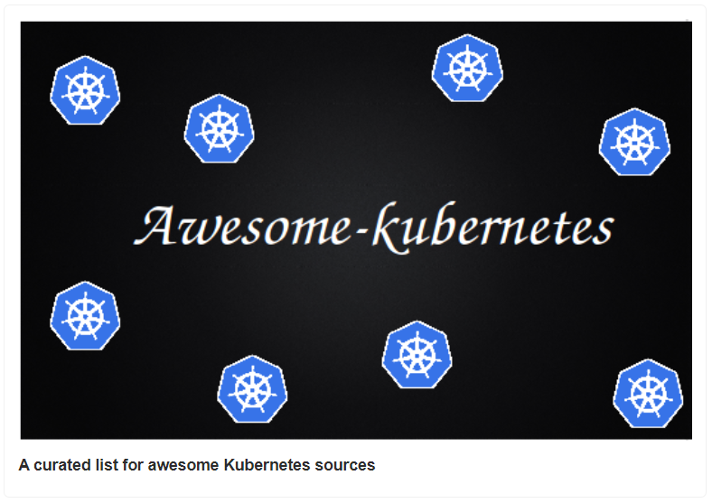

https://ramitsurana.github.io/awesome-kubernetes/?utm_source=www.techopsexamples.com&utm_medium=newsletter&utm_campaign=how-to-reduce-docker-image-size&_bhlid=68fb5ef8021e96b446114be8df915758590cd54f

## Picture Of The Day

.jpg>)

