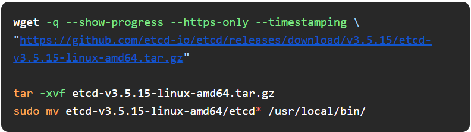
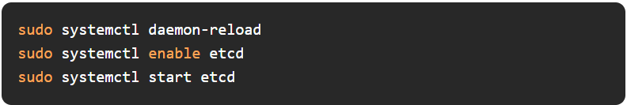

# How To Setup etcd Clusters

- How to Setup etcd Clusters

- PostgreSQL Databases under attack

- Optimize Messaging with IBM MQ on Red Hat OpenShift Service on AWS

- How To Structure Terraform Deployments At Scale

- Advanced DevOps Techniques: Scaling Microservices with Kubernetes

- Machine Learning for Beginners - 25 Lessons

## Use Case
### How To Setup etcd Clusters

To begin with - Etcd is a distributed, reliable key-value store designed to securely store configuration data and state information for distributed systems like Kubernetes.

It acts as the backbone of the Kubernetes control plane, ensuring that all components within the cluster are in sync and that the desired state of the cluster is maintained.

#### How ETCD works:

Etcd operates using a consensus algorithm called RAFT to maintain consistency across the distributed nodes.

In an etcd cluster, one node is elected as the leader, while the others are followers. The leader handles all write requests and propagates these changes to the followers to ensure data consistency across the cluster.

If the leader fails, a new leader is elected from the remaining nodes to maintain cluster operations without downtime.

.jpg>)

### Deployment Types:

Stacked etcd cluster - etcd instances run on the same nodes as the Kubernetes control plane components. This setup is simple but offers less resilience in the event of node failures.

This is generally suitable for smaller environments or development clusters where ease of setup and management is prioritized over high availability.

.gif>)
Ref: kubeadm

External etcd cluster - etcd runs on dedicated nodes separate from the control plane, offering enhanced resilience and fault tolerance.

This setup enhances resilience and fault tolerance, as failures in the control plane do not directly impact etcd, and vice versa.

It provides a higher level of availability, making it the preferred choice for production environments where maintaining cluster stability is crucial.

.gif>)

### Practical Step-by-Step Guide:

#### Step 1. Download and Install etcd

#### Step 2. Configure etcd

#### Step 3. Setup Environment Variables

#### Step 4. Create etcd Systemd Unit File

#### Step 5. Start the etcd Service

#### Step 5. Start the etcd Service

#### Step 6. Verify etcd Cluster Members

##### Tips and Tricks:

- Backup Regularly: Etcd stores critical Kubernetes data; regular backups are essential. Use the etcdctl snapshot save command to create backups.

- Monitor Leader Election: Keep an eye on the leader election process using etcd logs. Frequent elections might indicate an unstable cluster.

- Use TLS Encryption: Always configure TLS encryption for communication between etcd nodes and clients to secure the cluster.

Final reminder,

etcd is the backbone of Kubernetes and keeps everything in sync — get it right, and your Kubernetes stays solid.

## Tool Of The Day

https://github.com/wagoodman/dive?utm_source=www.techopsexamples.com&utm_medium=newsletter&utm_campaign=how-to-setup-etcd-clusters&_bhlid=1f7d670dea16ab6a52b59a6098b84e741f5d4cfc

## Trends & Updates

https://www.helpnetsecurity.com/2024/08/21/postgresql-prevent-cryptojacking/?utm_source=www.techopsexamples.com&utm_medium=newsletter&utm_campaign=how-to-setup-etcd-clusters&_bhlid=a3352b1d781fe78383936a135e80ee7040b72a58

https://aws.amazon.com/blogs/ibm-redhat/optimize-messaging-with-ibm-mq-on-red-hat-openshift-service-on-aws/?utm_source=www.techopsexamples.com&utm_medium=newsletter&utm_campaign=how-to-setup-etcd-clusters&_bhlid=68199e00e931a6dab8906993df5d1734c05063e1

## Resources & Tutorials

https://www.scalr.com/blog/terraform-structure?utm_source=www.techopsexamples.com&utm_medium=newsletter&utm_campaign=how-to-setup-etcd-clusters&_bhlid=51cd0d9f5026b330b75c59dd6a40607e139b1856

https://dev.to/nilebits/advanced-devops-techniques-scaling-microservices-with-kubernetes-4o90?utm_source=www.techopsexamples.com&utm_medium=newsletter&utm_campaign=how-to-setup-etcd-clusters&_bhlid=780046360ea48148010ecf93bef5c09dc53eac4a

https://microsoft.github.io/ML-For-Beginners/?utm_source=www.techopsexamples.com&utm_medium=newsletter&utm_campaign=how-to-setup-etcd-clusters&_bhlid=fc215fd19d701311938403ee15503c02ba8632a5#/

## Picture Of The Day

.jpg>)