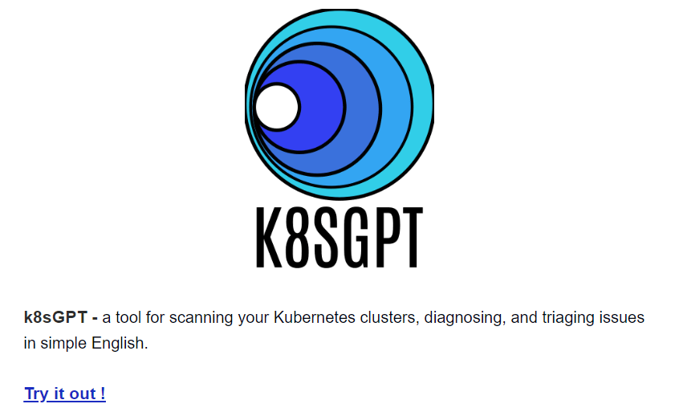

# Kubernetes Node Not Ready - How To Fix It

- Kubernetes Node Not Ready - How To Fix It ?

- Google Cloud Run now supports GPUs to host your LLMs

- Streamline Local Development with Dev Containers and Test containers

- The Ultimate Docker Cheat Sheet

- Talos Kubernetes on Proxmox using OpenTofu

- End-to-End DevOps Project: Building, Deploying, and Monitoring a Full-Stack Application

## Use Case

### Kubernetes Node Not Ready - How To Fix It ?
It is very familiar to see a mix of node statuses in a Kubernetes cluster, especially when troubleshooting. Sometimes, nodes might be marked as NotReady due to various issues.

##### Typically it looks like:

##### Behind the scenes:

The kubelet on each node is responsible for reporting the node's status to the control plane, specifically to the node-lifecycle-controller. The control plane then assesses this data (or the absence of it) to determine the node’s state.

This is what happens in the background:

.gif>)
Behind the Scenes

The node’s kubelet sends information about various checks it performs, including:

1.Whether the network for the container runtime is functional.

2.If the CSI (Container Storage Interface) provider on the node is fully initialized.

3.The completeness of the container runtime status checks.

4.The operational state of the container runtime itself.

5.The functionality of the pod lifecycle event generator.

6.Whether the node is in the process of shutting down.

7.The availability of sufficient CPU, memory, or pod capacity on the node.

This information is then relayed to the node-lifecycle-controller, which uses it to assign the node one of the following statuses:

. True: All checks have passed, indicating the node is operational and healthy.

. False: One or more checks have failed, showing the node has issues and isn’t functioning correctly.

. Unknown: The kubelet hasn’t communicated with the control plane within the expected timeframe, leaving the node's status unclear.

When the status is marked as Unknown, it usually indicates that the node has lost contact with the control plane, possibly due to network problems, kubelet crashes, or other communication failures.

#### Diagnosis:

##### 1. Node Status Check:

Run → Kubectl get nodes and watch out for the status ‘NotReady’ 

##### 2. Node Details and Conditions Check:

To dive deeper into why a node might be NotReady, use the kubectl describe command to get detailed information on the node's condition:

MemoryPressure: Node is low on memory.

DiskPressure: Node is running out of disk space.

PIDPressure: Node has too many processes running.

This output shows the node's current conditions and highlights the specific reason (PLEG is not healthy) for the NotReady status, allowing you to take appropriate action.

#### 3. Network Misconfiguration Check:

Run → ping <node-IP> to check connectivity between the nodes.

If there's packet loss, it indicates a possible network issue that might be causing the node's NotReady status.

#### 4. Kubelet Issue Check:

Run → systemctl status kubelet on the node to verify if the kubelet service is running properly.

If the kubelet is down, it may be the reason for the node's NotReady status.

#### 5. Kube-proxy Issue Check:

Run → kubectl get pods -n kube-system -o wide | grep kube-proxy to check the status of the kube-proxy pods on the node.

If the kube-proxy pod is in a crash loop or not running, it could cause network issues leading to the NotReady status.

### How To Fix:

#### 1. Resolve Lack of Resources:

. Increase Resources: Scale up the node or optimize pod resource requests and limits.

. Monitor & Clean: Use top or htop to monitor usage, stop non-Kubernetes processes, and check for hardware issues.

#### 2. Resolve Kubelet Issues:

. Check Status: Run systemctl status kubelet.

. active (running): Kubelet is fine; the issue might be elsewhere.

. active (exited): Restart with sudo systemctl restart kubelet.

. inactive (dead): Check logs with sudo cat /var/log/kubelet.log to diagnose.

#### 3. Resolve Kube-proxy Issues:

. Check Logs: Use kubectl logs <kube-proxy-pod-name> -n kube-system to review logs.

. DaemonSet: Ensure the kube-proxy DaemonSet is configured correctly. If needed, delete the kube-proxy pod to force a restart.

#### 4. Checking Connectivity:

. Network Setup: Verify network configuration, ensure necessary ports are open.

. Test Connections: Use ping <node-IP> and traceroute <node-IP> to check network connectivity.

I believe the next time you see "NotReady," you'll know the reason and where to begin checking!

## Tool Of The Day

https://k8sgpt.ai/?utm_source=www.techopsexamples.com&utm_medium=newsletter&utm_campaign=kubernetes-node-not-ready-how-to-fix-it&_bhlid=9cf68b6ceb9ce62af3d0f9864dfe254f5a30c8cb

## Trends & Updates

https://cloud.google.com/blog/products/application-development/run-your-ai-inference-applications-on-cloud-run-with-nvidia-gpus?utm_source=www.techopsexamples.com&utm_medium=newsletter&utm_campaign=kubernetes-node-not-ready-how-to-fix-it&_bhlid=b18b40c8d2df1859da0df4183510545a75e410bb

https://www.docker.com/blog/streamlining-local-development-with-dev-containers-and-testcontainers-cloud/?utm_source=www.techopsexamples.com&utm_medium=newsletter&utm_campaign=kubernetes-node-not-ready-how-to-fix-it&_bhlid=a4ea09b54a55e5532c15c668aa26550cfa891af7

## Resources & Tutorials

https://devopscycle.com/blog/the-ultimate-docker-cheat-sheet/?utm_source=www.techopsexamples.com&utm_medium=newsletter&utm_campaign=kubernetes-node-not-ready-how-to-fix-it&_bhlid=d2c6b2f9f6f7ea71e0d7455a28970a7c28cabe9b

https://blog.stonegarden.dev/articles/2024/08/talos-proxmox-tofu/?utm_source=www.techopsexamples.com&utm_medium=newsletter&utm_campaign=kubernetes-node-not-ready-how-to-fix-it&_bhlid=fbbdc224b3ee4b84d45a1fe6364429d0138f4b5d

https://dev.to/prodevopsguytech/end-to-end-devops-project-building-deploying-and-monitoring-a-full-stack-application-ako

## Picture Of The Day

.jpg>)

