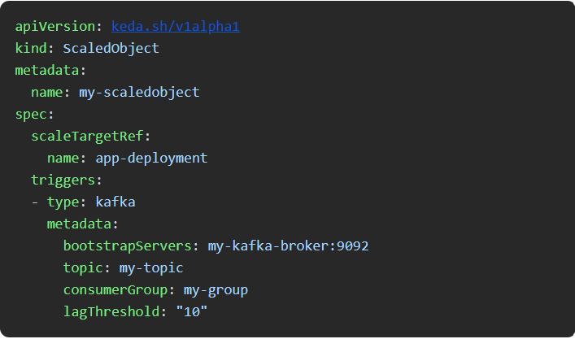
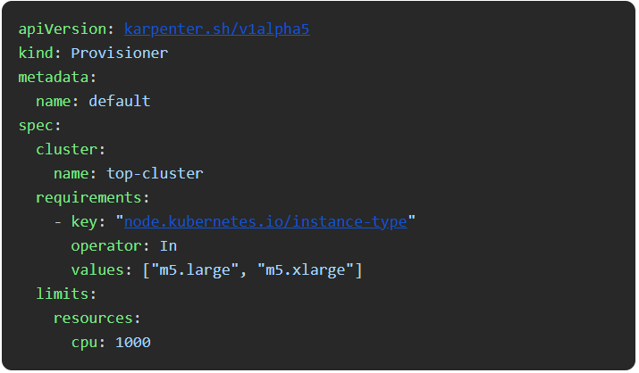
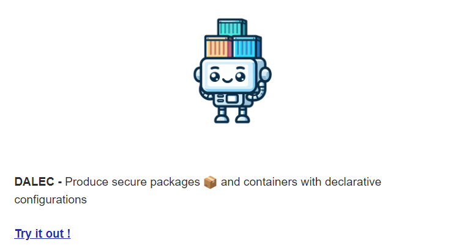
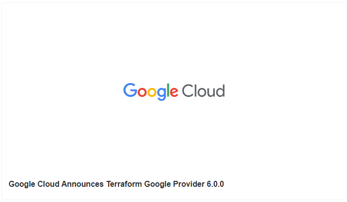
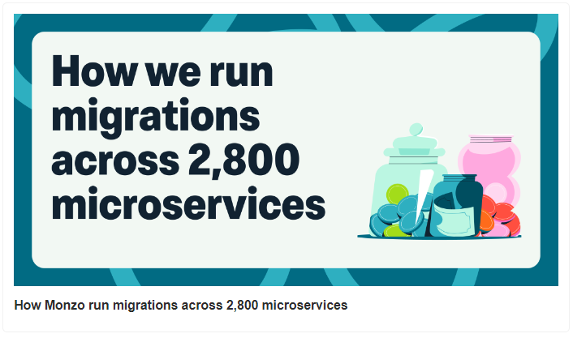
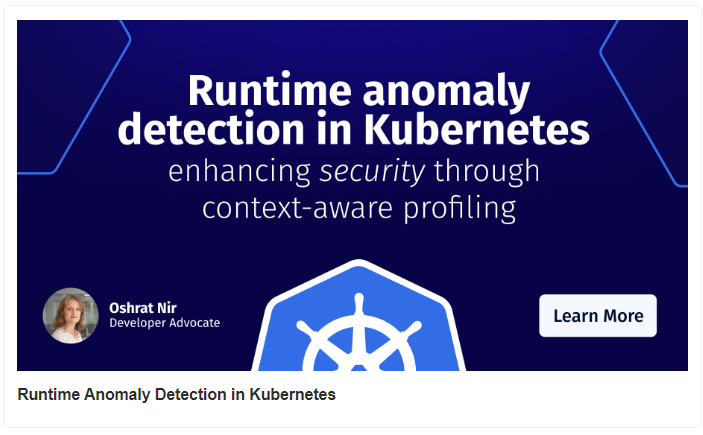
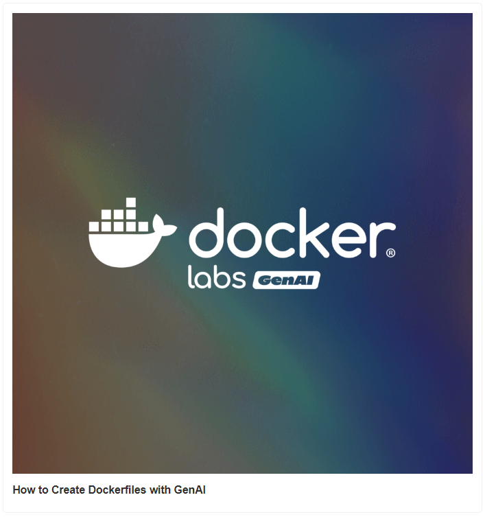
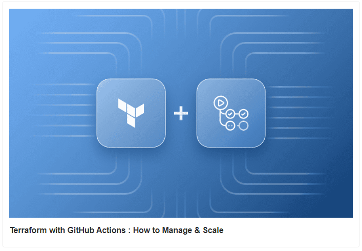

# KEDA vs Karpenter - Which One to Choose

. KEDA vs Karpenter - Which One to Choose ?

. Google Cloud Announces Terraform Google Provider 6.0.0

. How Monzo run migrations across 2,800 microservices

. Runtime anomaly detection in Kubernetes

. How to Create Dockerfiles with GenAI

. Terraform with GitHub Actions : How to Manage & Scale

## Use Case

### KEDA vs Karpenter - Which One to Choose?

Kubernetes practitioners often find themselves unsure whether to choose KEDA or Karpenter, as both offer valuable but distinct approaches to scaling within their clusters.

Let’s understand the basics first..

#### KEDA:
Specializes in scaling your applications based on external event sources, making it perfect for workloads that need to respond to specific events like messages in a queue.

.png>)
KEDA workflow

. KEDA receives events from sources like Kafka or RabbitMQ.

. The KEDA operator processes these events using its metrics adapter, controller, and scaler.

. Metrics are sent to the Kubernetes API server.

. Kubernetes API server communicates with the Horizontal Pod Autoscaler (HPA).

. HPA adjusts the number of pods in your deployments based on these metrics.

### Karpenter:

Automatically provisions new nodes specifically when unscheduled pods are detected, ensuring your cluster scales efficiently by adding the exact resources needed.

.png>)

. Karpenter detects unscheduled pods in the cluster.

. The Karpenter controller defines the provisioning requirements using the Provisioner CRD.

. It interacts with the cloud provider API to provision new nodes.

. Once the nodes are ready, the Kubernetes scheduler assigns the unscheduled pods to these new nodes.

Quick Setup Comparison:
### KEDA Sample Configuration:

#### Karpenter Sample Configuration:

###### When to Use:

KEDA: Ideal for event-driven workloads. If your application scales based on external events or metrics like queue length, Kafka messages, or custom metrics, KEDA integrates seamlessly.

Real-life Applications: Processing orders in e-commerce platforms, handling IoT sensor data, or managing email notifications.

Karpenter: Perfect for dynamic infrastructure scaling. If you need to scale your cluster by adding or removing nodes based on the demands of unscheduled pods, Karpenter is your go-to.

Karpenter efficiently manages cluster capacity, ensuring the right resources are available when workloads fluctuate.

Real-life Applications: Running AI/ML workloads, handling video rendering jobs, or scaling cloud gaming servers.

The right choice depends on the specific needs of your workloads and cluster management strategy.

## Tool Of The Day

https://azure.github.io/dalec/?utm_source=www.techopsexamples.com&utm_medium=newsletter&utm_campaign=keda-vs-karpenter-which-one-to-choose&_bhlid=45444c72690b557789b7321145a29f0970ac8479

## Trends & Updates

https://cloud.google.com/blog/products/management-tools/announcing-terraform-google-provider-6-0-0?utm_source=www.techopsexamples.com&utm_medium=newsletter&utm_campaign=keda-vs-karpenter-which-one-to-choose&_bhlid=ec4d7590295809244ee83e57762d16558a1c1ce2

https://monzo.com/blog/how-we-run-migrations-across-2800-microservices?utm_source=www.techopsexamples.com&utm_medium=newsletter&utm_campaign=keda-vs-karpenter-which-one-to-choose&_bhlid=4f2d163a9039115e1274bc9a2c5ea35be9dd4bae

## Resources & Tutorials

https://www.armosec.io/blog/kubernetes-runtime-anomaly-detection/?utm_source=www.techopsexamples.com&utm_medium=newsletter&utm_campaign=keda-vs-karpenter-which-one-to-choose&_bhlid=1b644572d34c8da63a16976a4460a777e8579754

https://www.docker.com/blog/how-to-create-dockerfiles-with-genai/?utm_source=www.techopsexamples.com&utm_medium=newsletter&utm_campaign=keda-vs-karpenter-which-one-to-choose&_bhlid=5075fcc8f139ed8afd2df819bacbde9c80cf281d

https://spacelift.io/blog/github-actions-terraform?utm_source=www.techopsexamples.com&utm_medium=newsletter&utm_campaign=keda-vs-karpenter-which-one-to-choose&_bhlid=ea9f2cb8aba83bc9a76ec682f4f1087865768f24